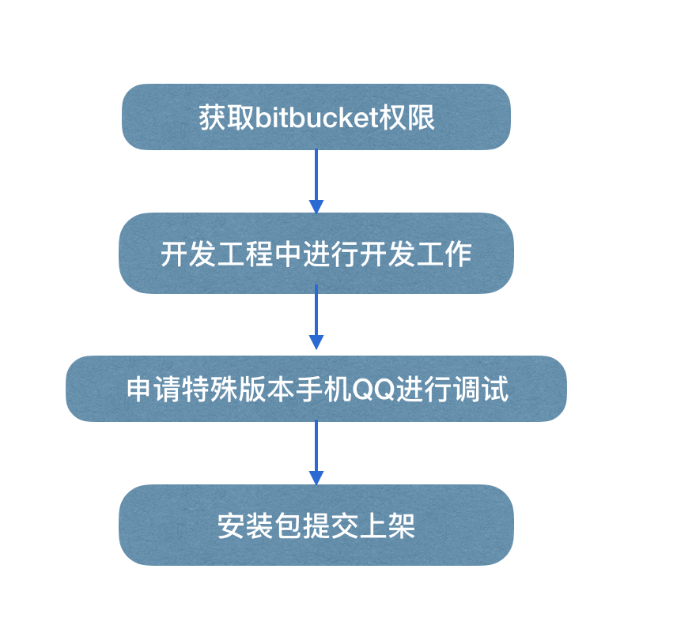

#Bricks 引擎

bricks引擎是腾讯自研，嵌入手Q内部跨平台的2d游戏引擎。

bricks引擎接入层使用JavaScript语言作为驱动层，支持的版本为**ES5**。

#如何开发厘米小游戏

###获取bucketbit库权限
开发团队需向腾讯申请bitbucket库读权限获取开发工程方进行开发，目前仅支持macos平台使用xcode工程开发，具体bitbucket连接[点击此处](https://bitbucket.org/wesleyxiao/publicbrickengine/overview)

###开发流程
不同于其他引擎，因涉及将游戏运行至手机QQ，因此开发者需要在开发工程开发完后，还需向腾讯申请特殊版本的手机QQ，在手机QQ版本的运行测试。

