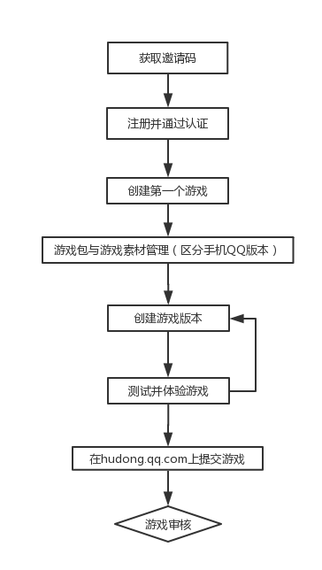
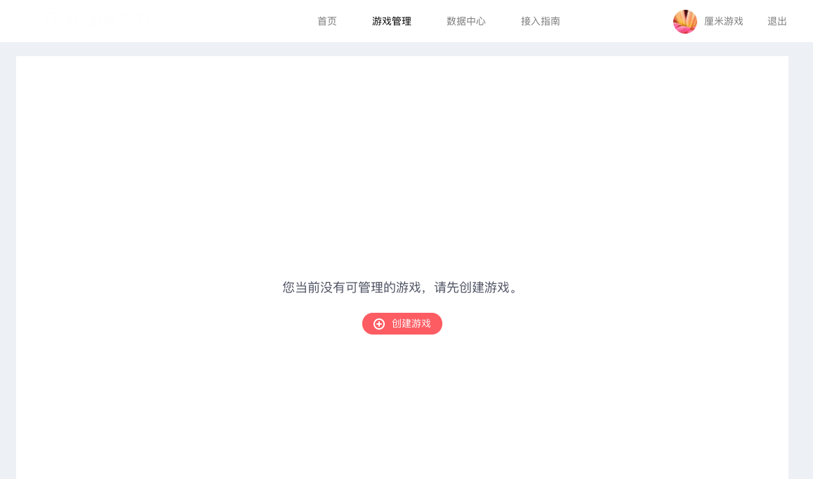
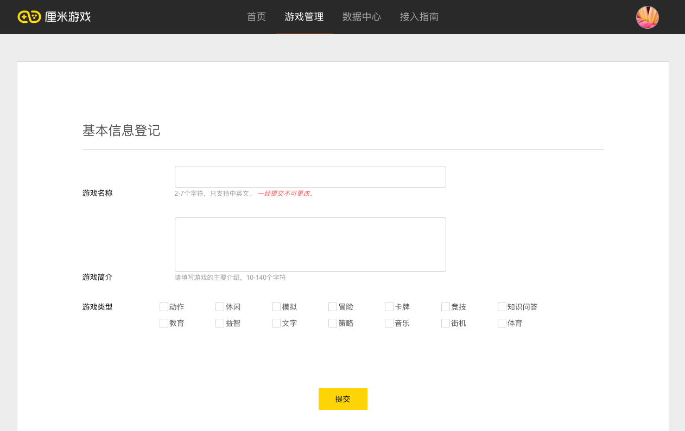
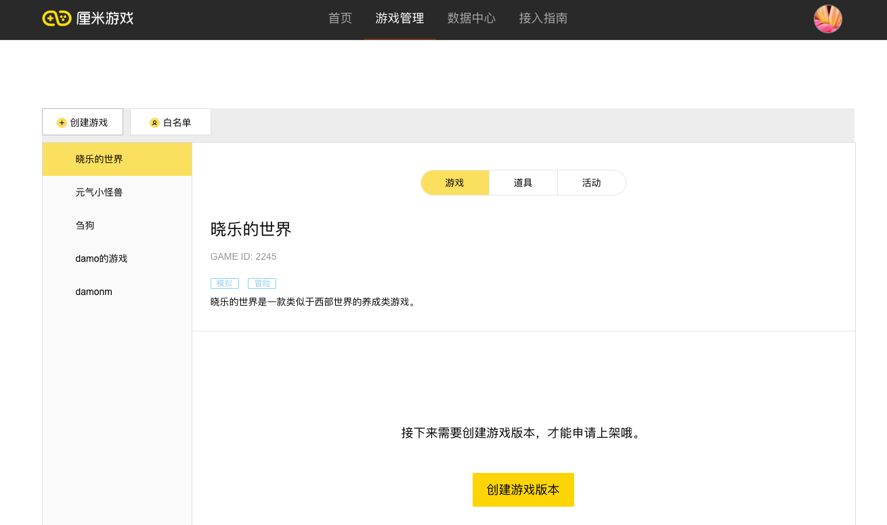
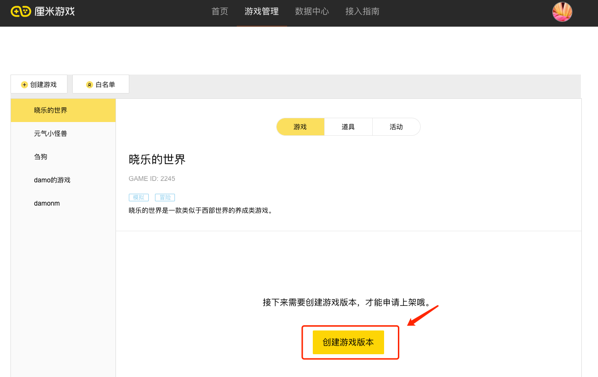

# 最小demo制作
您可以在游戏管理章节看到一个完整的游戏管理流程，在这里，我们将其简化成一个最简单的游戏制作流程，使您对在厘米游戏平台上面上架游戏有一个直观的认识。现阶段，厘米游戏尚未大规模开放注册，在开始最小demo制作之前，您仍然需要申请获得邀请码。最小demo的制作流程如下：

### 1. 获取邀请码
请发送您的公司（团队）介绍与您即将制作的游戏介绍至 hudong@tencent.com ,我们会对方案进行综合评审之后决定是否发放邀请码。

### 2. 注册并等待认证审核
1. 登录 https://ssl.zc.qq.com/v3/index-chs.html 注册一个新的QQ号码
2. 使用新注册的账号登录 hudong.qq.com 。（这里需要特别说明一下，新申请QQ号不是必须的，但是我们建议使用新QQ号，具体原因参见《游戏管理流程》中《游戏开始制作前的准备》这一节）
3. 点击开始认证，填写已经获得的邀请码，进入认证信息填写阶段，填写相关的信息
4. 点击提交审核，等待审核通过，团队将会定期查看提交审核的信息并进行审批，如果想要加速审核流程，请发送邮件至 hudong@tencent.com，并在邮件中说明登录 hudong.qq.com 的QQ号与加速认证通过的诉求。

### 3. 创建游戏
在认证通过之后，进入游戏管理页面，在游戏管理页面可以创建游戏。

点击创建游戏，并在跳转到的页面中填写相关的信息，点击提交。

之后会游戏管理页面的左边出现了刚才添加的游戏。

现在，一个游戏就已经创建好了，此时，您已经生成了一个gameID，同时，我们的后台也增加了一条关于您刚刚创建的游戏的记录。

### 4. 创建游戏版本
您可以在创建游戏之后获取gameID之后，紧接着创建游戏版本，也可以先行开发游戏，在本demo中，我们直接创建游戏版本。
点击“创建游戏版本”，进入游戏版本创建页

进入游戏创建页面之后，填写相关的字段，相关的字段填写规则可以如下：

| 字段名 | 是否必选 | 含义 | 默认值 | 备注 |
| -- | -- | -- | -- | -- |
| 游戏名称 | 是 | 游戏名 | 无 | 一经填写之后不得更改 |
| 游戏简介 | 是 |游戏的简要说明 | 无 | 每次创建版本的时候都可以更改 |
| 游戏类型 | 是 |游戏归属的类型 | 无 | 主要用于后期游戏个性化推荐，每次创建版本的时候都可以更改 |
| 支持最大玩家数 | 是 | 游戏中支持的最大玩家数，比如游戏有2人，3人，4人玩法，此字段填写为4 | 默认2人 | 最多支持8个人 |
| 单局最大时长 | 是 | 单局游戏可能的最大时间长度 | 默认180s | 单局游戏时长最多900s |
| 是否帧同步 | 是 | 请参见[通信协议](http://hudong.qq.com/docs/engine/room/room-protocol.html ) | 使用 | |
| 帧同步时间间隔 | 是 | 两帧之间的时间间隔 | 1000ms | 最小间隔100ms，最大间隔1000ms |
| 内容素材包 | 是 | 游戏部分配置信息和游戏部分图片素材 | 无 | 可以参考《游戏制作过程中需要提交的材料》自己生成游戏包，也可以使用[内容素材包demo](https://share.weiyun.com/45c6ffc1bf14a8180933b8e9e95dc449) |
| 游戏包 | 是 | 请参见[打包规则](http://hudong.qq.com/docs/engine/mqq/package.html) | 无 | 可以参考使用[游戏demo包](https://share.weiyun.com/9f358d456278e142d121d241974f4c4d )|
| 最低手Q支持版本 | 是 | 最低能够支持的手Q版本，最低选择735版本 | 7.3.5 | 为了支持最新特性，建议上架至当前外网手Q版本 |
| 提交人 | 是 | 开发者团队内部管控作用 | 无 |  |
| 版本备注 | 否 | 说明版本的主要功能，开发者团队内部管控作用 | 无 | | |

### 5. 测试并体验游戏
将您需要测试的QQ号加入白名单，同时，然后，使用加入了加入了白名单之后的QQ号扫描游戏详情页中的二维码，即可开始游戏。

### 6. 提交审核
当游戏测试没有问题之后，点击“提交审核”的按钮将游戏提交给我们审核，通过我们的审核之后，该游戏将发布到外网手机QQ用户可见。

### 7. 宣传并推广您的游戏
当您的游戏通过审核之后，我们会根据游戏的数据表现自动推送相应数量的种子用户。

如果游戏表现足够好，我们也会将游戏放置在曝光量更大的入口中。

同时，您也可以将您的游戏发送到QQ群中，发送到公开场合来推广您的游戏。

