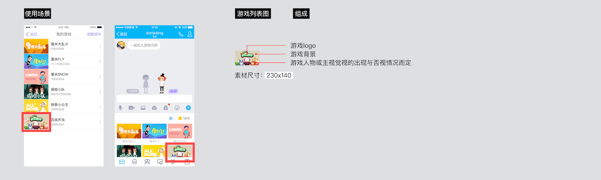
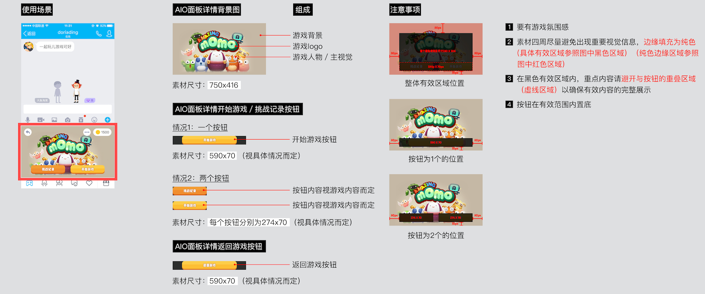
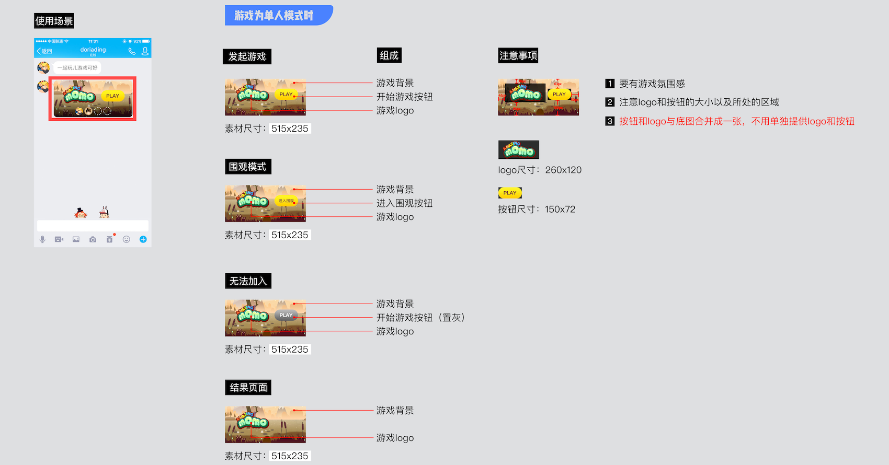
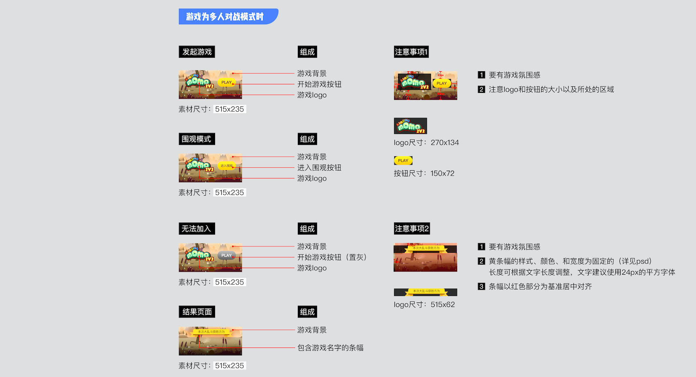
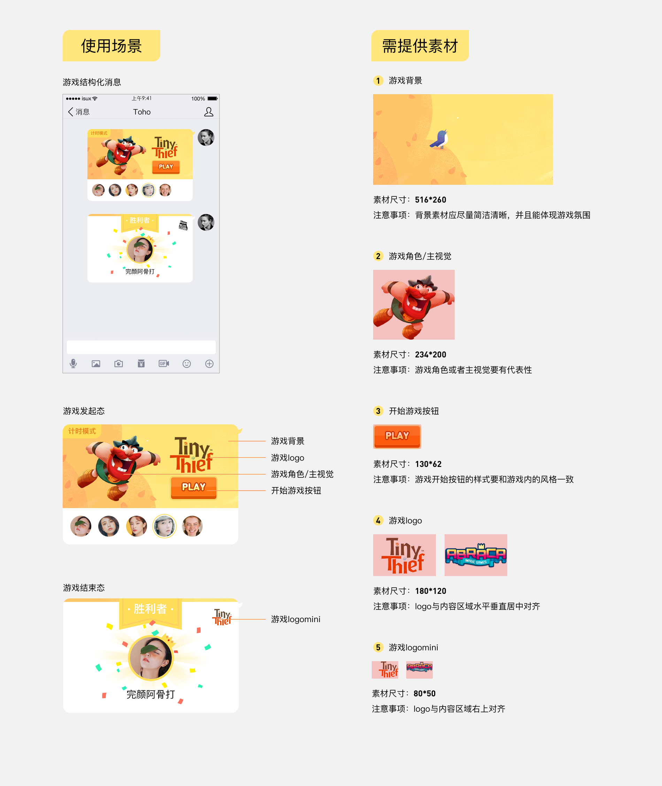
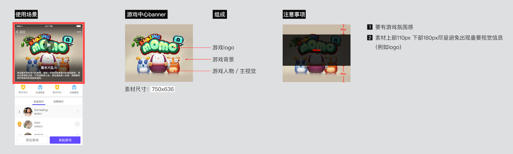
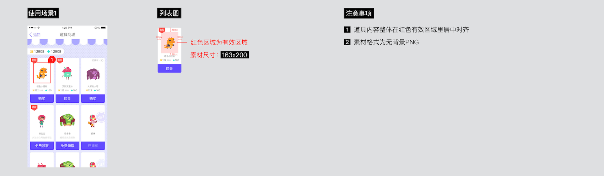
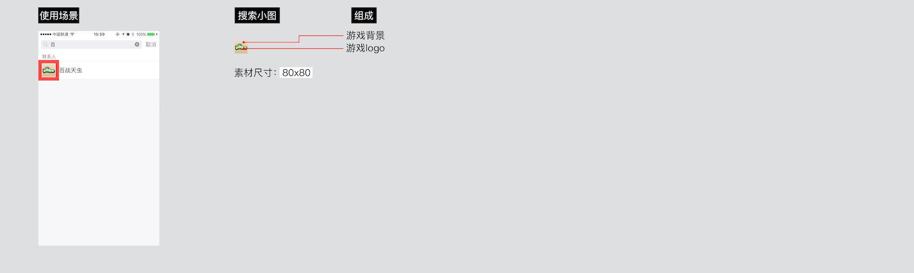
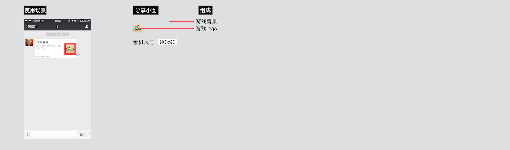

# 设计规范

在提交游戏的过程中，开发者需要提供一些素材，这些素材在提供的时候需要遵循一定的设计规范。
开发者提交的素材主要包括4方面,下文简要说明了需要的文件类型，需要分辨率更高的素材，可以参见[png]( https://share.weiyun.com/b68cd6e7e78d854d69b4e9937a3a7188 )/[素材示例]( https://share.weiyun.com/334ea8ebb6b47f0bc19d65438ad00f0c ) /[psd文件]( https://share.weiyun.com/f481215b8d2aca3193c0ec265567a0a7 )：
1. 聊天页面中提供的素材；
2. 游戏首页中需要提供的素材；
3. 道具需要提供的素材；
4. 其它附属素材；

需要特别说明的是：
- 单个图片必须小于100KB；
- 图片必须为png格式；
- 聊天页面中的素材需要着重压缩，按钮大小建议小于3.5KB，游戏面板小图建议小于20KB，游戏面板大图建议小于35KB;

### 聊天页面中需要提供的素材：
我们称聊天窗口为AIO（all in one）窗口,在这个窗口中，聊天页面是玩家展示游戏最主要的入口：
1. 游戏面板小图；

2. 游戏面板大图和游戏按钮（一个或者两个）；

3. 游戏开始前/进行中/结束后AIO消息列表消息图片

在这个部分，手Q 735之前和手Q 735之后，提供的素材有较大的不同， Q 735之前需要提供的素材包括：

在手Q 735及之后需要提供的素材包括：

在hudong.qq.com上面上线的游戏，只能上线到735及以后；

### 游戏首页中需要提供的素材：
1. 游戏首页的banner图；

3. 游戏首页入口图片（最多配置4个入口）:分辨率500\*500, 背景为透明色

### 道具需要提供的素材：
1. 道具商城列表图

2. 道具商城详情图

### 其它附属素材：
1. 搜索小图

2. 微信分享小图
