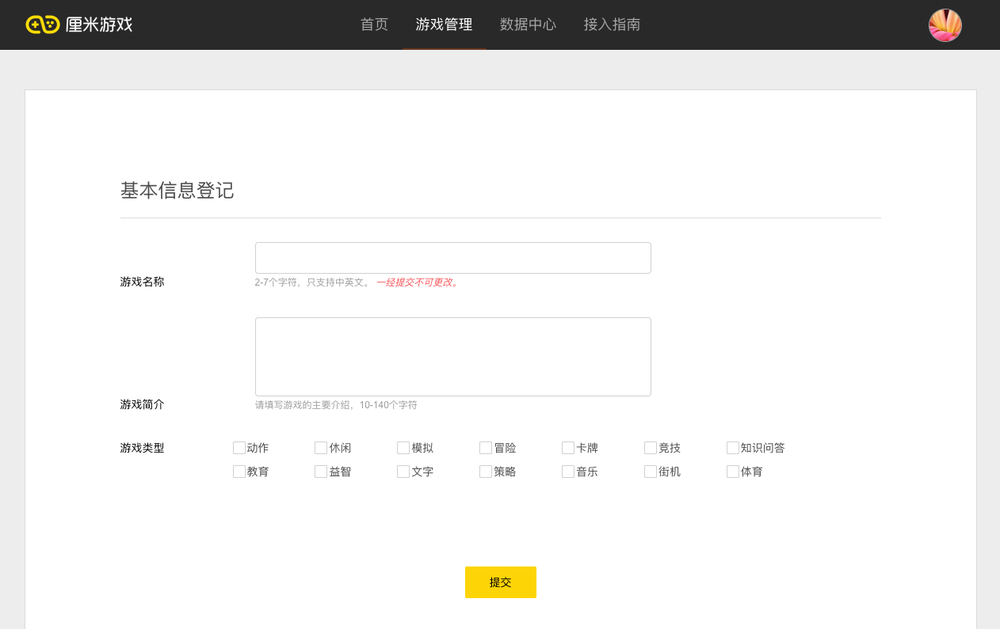

# 游戏上架

## 1. 获取邀请码
请发送邮件至 hudong@tencent.com 申请邀请码。

非常抱歉的是，现阶段邀请码并不是申请即可获得的，为保证游戏品质，我们会对游戏厂商和提案综合评估之后，决定是否发放邀请码。如果您有意向申请邀请码，请发送您公司的介绍与您接下来希望做的游戏提案至 hudong.qq.com 申请邀请码，我们会在每周二组织团队评审，决定是否发放邀请码。

## 2. 注册并等待认证审核
1. 登录 https://ssl.zc.qq.com/v3/index-chs.html 注册一个新的QQ号码
2. 使用新注册的账号登录 hudong.qq.com 。（这里需要特别说明一下，新申请QQ号不是必须的，但是我们建议使用新QQ号）
3. 点击开始认证，填写已经获得的邀请码，进入认证信息填写阶段，填写相关的信息
4. 点击提交审核，等待审核通过，团队将会定期查看提交审核的信息并进行审批，如果想要加速审核流程，请发送邮件至 hudong@tencent.com，并在邮件中说明登录 hudong.qq.com 的QQ号与加速认证通过的诉求。


### 您需要提前准备一个QQ号，一个bitbucket账号和一个服务号

您需要准备一个QQ号，一个bitbucket账号和一个服务号。

你需要使用准备好的QQ号登录 hudong.qq.com. 这个QQ将是您管理游戏的唯一凭证，且现阶段整个团队只有一个账号可以登录，因此极力建议您使用团队公用账号登录，并保管好账号。同时，因为在注册过程中会给您生成一个新的手机QQ 服务号，需要确认此QQ号之前不能注册过其它手Q服务号。

Bitbucket是一个不开源的git，我们通过bitbucket来维护引擎代码，通过授权的开发者可以在上面下载到引擎。您开始开发游戏之前，请先自行申请游戏bitbucket账号，申请完成后，请发送邮件给 hudong@tencent.com 申请引擎访问权限（需要包含您的账户名），我们将每天统一处理一次权限申请。

如果您是腾讯公司外的开发者，服务号会在认证过程中自动生成，登录 hudong.qq.com 时使用的QQ号码，即为服务号管理员号码。

如果您是腾讯公司内部的开发者，服务号需要走内部号注册流程，内部号注册流程可以参见： http://tapd.oa.com/TencentC2B/markdown_wikis/#1010096871006115291

对于公司内开发者（请注意，这里只针对腾讯公司内部开发者），注册完成之后，需要将以下三项信息提供给我们导入后台：

1.	管理员QQ号；
2.	appid（一串以2开头的9位数字，可以联系内部号联系人获得）；
3.	puin（获取方法可以参见 [手机QQ接入流程-公众号](https://hudong.qq.com/docs/engine/mqq/pubAccount.html) )

服务号在我们的游戏开发过程中具有非常重要的作用。
1. 服务号的管理员账号同时也是厘米游戏平台的管理员账号，需要使用此账号登录 hudong.qq.com；
2. 服务号可以将用户的QQ号码转换成相应的openid，方便开发者识别用户；
3. 您可以引导开发者关注您的服务号，利用服务号触达用户或做商业化尝试。

因此，拥有一个手机QQ的服务号对你们来说是非常关键的。

同时，考虑到后续运营过程中，服务号会经常用到，我们极力建议您使用团队公用账号注册 hudong.qq.com。

关于服务号，还有一些常见的问题
1. 我能否用我的私人QQ号登录：使用私人账号登录是您的权利，但是我们极力建议您使用团队公用QQ号登录；
2. 手Q服务号和手Q订阅号有什么区别：服务号可以给玩家定制化得发送一些消息，但是每个月能发送的配额有限，订阅号功能较为受限，但是每天可以给每位玩家推送一条消息；
3. 我能用订阅号么：对于公司外的开发者，服务号将会在认证过程中自动生成，不可以使用订阅号，对于公司内开发者，可以选择使用订阅号；
4. 我是否需要认证：服务号是否通过认证和厘米游戏能否上线并无关联；
5. 我是否要开通开发者模式：服务号是否开通开发者模式和厘米游戏能否上线并无关联；
7. 填写的服务号信息还可以改动么：通过认证后，服务号名称和服务号id均不可更改，服务号简介和头像可以更改；
8. 这个服务号可以在哪里看到：服务号通过认证之后，您可以通过手Q搜索到您的服务号，在通过认证之前，只能通过扫描服务号二维码关注；
9. 我在哪里管理我的服务号：服务号的管理和游戏的管理并不是在一个平台，服务号的管理在 mp.qq.com, 游戏的管理在 hudong.qq.com.


## 3. 创建游戏
在认证通过之后，进入游戏管理页面，在游戏管理页面可以创建游戏。


点击创建游戏，并在跳转到的页面中填写相关的信息，点击提交。


之后会游戏管理页面的左边出现了刚才添加的游戏。


现在，一个游戏就已经创建好了，此时，您已经生成了一个gameID，同时，我们的后台也增加了一条关于您刚刚创建的游戏的记录。

## 4. 创建游戏版本
您可以在创建游戏之后获取gameID之后，紧接着创建游戏版本，也可以先行开发游戏。
点击“创建游戏版本”，进入游戏版本创建页


### 创建游戏版本各字段说明：

| 字段名 | 是否必选 | 含义 | 默认值 | 备注 |
| -- | -- | -- | -- | -- |
| 游戏名称 | 是 | 游戏名 | 无 | 一经填写之后不得更改 |
| 游戏简介 | 是 |游戏的简要说明 | 无 | 每次创建版本的时候都可以更改 |
| 游戏类型 | 是 |游戏归属的类型 | 无 | 主要用于后期游戏个性化推荐，每次创建版本的时候都可以更改 |
| 支持最大玩家数 | 是 | 游戏中支持的最大玩家数，比如游戏有2人，3人，4人玩法，此字段填写为4 | 默认2人 | 最多支持8个人 |
| 单局最大时长 | 是 | 单局游戏可能的最大时间长度 | 默认180s | 单局游戏时长最多900s |
| 是否帧同步 | 是 | 请参见[通信协议](http://hudong.qq.com/docs/engine/room/room-protocol.html ) | 使用 | |
| 帧同步时间间隔 | 是 | 两帧之间的时间间隔 | 1000ms | 最小间隔100ms，最大间隔1000ms |
| 内容素材包 | 是 | 游戏部分配置信息和游戏部分图片素材 | 无 | 可以参考《游戏制作过程中需要提交的材料》自己生成游戏包，也可以使用[内容素材包demo](https://share.weiyun.com/9d4c1c192fdecfbb6456e26f6c430982) |
| 游戏包 | 是 | 请参见[打包规则](http://hudong.qq.com/docs/engine/mqq/package.html) | 无 | 可以参考使用[游戏demo包](https://share.weiyun.com/a667cf62904a64bc6b2d7654abde06c6)|
| 最低手Q支持版本 | 是 | 最低能够支持的手Q版本，最低选择735版本 | 7.3.5 | 为了支持最新特性，建议上架至当前外网手Q版本 |
| 提交人 | 是 | 开发者团队内部管控作用 | 无 |  |
| 版本备注 | 否 | 说明版本的主要功能，开发者团队内部管控作用 | 无 | | |


### 内容素材包文件说明


游戏素材包主要包括部分图片素材和一个config.json的文件，图片素材主要用于手Q聊天窗口需要展示的图片，厘米游戏自定义游戏首页中的配置，config.json主要用于涉及游戏的配置项。

#### config.json 说明

其中，config.json 文件内容如下表所示：

|      字段名      |   类型   | 是否必选 |                                       含义                                        | 默认 |
| ---------------- | -------- | -------- | --------------------------------------------------------------------------------- | ---- |
| gameBtn          | [Number] | 是       | 配置在聊天窗口中显示的按钮，共有[0]/[6,0]/[2,0]三种不同组合，不得有其它的组合方式 | 无   |
| bigCoverBgColor  | String   | 是       | bigCover 背景色，色值以十六进制表示法表示                                         | 无   |
| needOpenkey      | Number   | 否       | 表示是否需要 Openkey, 1 为肯定, 0 为否定，只提供给腾讯内部开发者使用              | 0    |
| appId            | String   | 否       | 必须使用needOpenkey,只提供给腾讯内部开发者使用                                    | 无   |
| homeButtonAction | [Nubmer] | 否       | 游戏面板右上角homeButton的功能，必须置为[1]，按钮含义可以参见下面的按钮模式说明   | 无   |

在config.json中配置一定的字段，需要同时在内容素材包中加入相应的图片素材，需要的图片素材类型枚举如下（具体的图片素材名称含义，可以参考“[图片素材清单](#图片素材清单)”）：

* gameBtn选择[0]的按钮组合，需要提供normalBkg_btn_0.png和playing_btn_0.png共两张图片;

* gameBtn选择[6,0]的按钮组合的话，需要提供normalBkg_btn_6.png，playing_btn_6.png，normalBkg_btn_0.png，playing_btn_0.png共四张图片;

* gameBtn选择[2,0]的按钮组合的话，需要提供normalBkg_btn_2.png，playing_btn_2.png，normalBkg_btn_0.png，playing_btn_0.png共四张图片；

* homeButtonAction选择[1],需要提供playing_btn_1.png共一张图片。

其中，各个按钮的含义如下：

| mode |  按钮含义  | 是否会发送消息 |                                     备注                                     |
| ---- | ---------- | -------------- | ---------------------------------------------------------------------------- |
| 0    | 开始游戏   | 会发送消息     | 需要提供“开始游戏”模式对应的normalBkg_btn_0.png和playing_btn_0.png两张图片   |
| 1    | 开始游戏   | 不会发送消息   | 需要提供playing_btn_1.png共一张图片                                          |
| 2    | 挑战记录   | 不发消息       | 需要提供“挑战记录”模式对应的normalBkg_btn_2.png和playing_btn_2.png两张图片   |
| 6    | 陌生人匹配 | 不会发送消息   | 需要提供“陌生人匹配”模式对应的normalBkg_btn_6.png和playing_btn_6.png两张图片 |


#### config.json 示例

```js
"gameBtn": [6,0],
"bigCoverBgColor": "#3B65DD",
"needOpenkey": 0,
"appId": "",
"homeButtonAction": [1],
```

#### 图片素材清单

图片素材清单如下（需要特别说明的是，图片的命名必须和下面的文件名相同），图片设计规则可以参见[设计规范](http://hudong.qq.com/docs/access/designRules.html) ：

|  文件名 | 是否必选 | 描述 | 图片尺寸 | 图片大小 |
| -- | -- | -- | -- | -- |
| `aio_icon_230_140.png` | 是 | 游戏在聊天面板底部展开时游戏封面图 | 230 * 140 | 小于15K |
| `aio_panel_750_416.png` | 是 | 游戏在游戏首页所展示的图片 | 750 * 416 | 小于35K |
| `background.png` | 是 | 在聊天窗口ARK结构化消息中的游戏背景 | 516 * 260 | 小于15K |
| `game_main.png` | 是 | 在聊天窗口中ARK结构化消息的游戏角色/主视觉 | 234 * 200 | 小于15K |
| `button.png` | 是 | 在聊天窗口中ARK结构化消息的开始游戏按钮 | 130 * 62 | 小于10K |
| `logo.png` | 是 | 在聊天窗口中ARK结构化消息的游戏logo | 180 * 120 | 小于 15K |
| `logomini.png` | 是 | ARK 结构化消息游戏mini logo | 80 * 50 | 小于10K |
| `normalBkg_btn_0.png` | 否 | gameMode 0 对应的开始游戏之前的按钮样式 | 参见设计规范 | 小于5K |
| `playing_btn_0.png` | 否 | gameMode 0 对应的游戏进行中的按钮样式 | 参见设计规范  | 小于5K |
| `playing_btn_1.png` | 否 | gameMode 1 对应的游戏进行中的按钮样式（返回按钮） | 590 * 70 | 小于5K |
| `normalBkg_btn_2.png` | 否 | gameMode 2 对应的开始游戏之前的按钮样式 | 参见设计规范 | 小于5K |
| `playing_btn_2.png` | 否 | gameMode 2 对应的游戏进行中的按钮样式 | 参见设计规范 | 小于5K |
| `normalBkg_btn_6.png` | 否 | gameMode 6 对应的开始游戏之前的按钮样式 | 参见设计规范 | 小于5K |
| `playing_btn_6.png` | 否 | gameMode 6 对应的游戏进行中的按钮样式 | 参见设计规范 | 小于5K |


## 5. 测试并体验游戏
将您需要测试的QQ号加入白名单，同时，然后，使用加入了加入了白名单之后的QQ号扫描游戏详情页中的二维码，点击“开始游戏”，即可发起游戏。


### 6. 提交审核
当游戏测试没有问题之后，点击“提交审核”的按钮将游戏提交给我们审核，通过我们的审核之后，该游戏将发布到外网手机QQ用户可见。

## 7. 宣传并推广您的游戏
当您的游戏通过审核之后，我们会根据游戏的数据表现自动推送相应数量的种子用户。

如果游戏表现足够好，我们也会将游戏放置在曝光量更大的入口中。

同时，您也可以将您的游戏发送到QQ群中，发送到公开场合来推广您的游戏。
