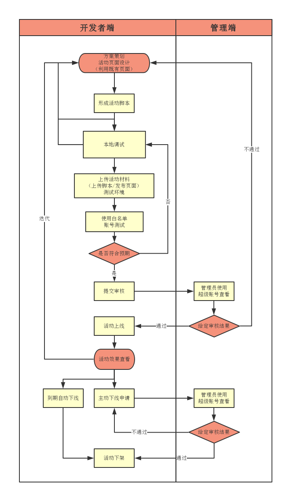

# 活动开发流程

### 活动开发流程

* 平台方提供页面设计规范、逻辑开发文档、开发框架
* 开发者基于设计规范和开发文档，开发HTML/CSS/JS/页面静态素材，以及活动逻辑JS脚本
* 开发者基于本地进行调试
* 开发者调试完成后，基于活动平台配置活动信息，活动信息既作为审核要件，也作为活动配置文件
* 开发者基于活动平台提交所有交付物，并基于活动平台进行调试
* 开发者调试完成后提交审核
* 平台方基于体验环境对第三方的交付件进行审核以及测试
* 平台方基于活动信息处理活动上架
* 开发者基于平台查看活动信息，或进行活动变更申请
* 平台方基于平台管理端进行活动管理

