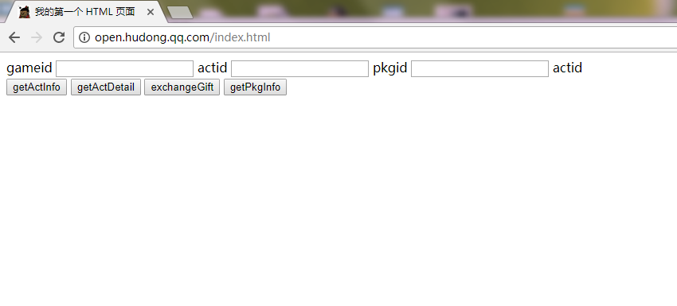

# 活动模拟环境

### 模拟环境作用

为了提高活动开发效率，开发者在游戏活动开发时，建议先下载活动模拟环境套件进行活动页面和逻辑脚本的初步开发调试。

最新版本的模拟套件，可以在互动游戏平台的官方网站下载栏目下载。

### 模拟环境的文件组成

模拟环境套件由一个node工程构成，其目录结构如下：

    node_emulator
    * config.json
    * favicon.ico 
    * hudong_sdk.js
    * index.js
    * package.json
    * static.js
    * data
    	* config.json
    	* actinfo.json
    	* actuserinfo.json
    	* followinfo.json
    	* iteminfo.json
    	* recordinfo.json
    	* usrscoreinfo.json
    * global
    	* globallib.js
    * jsWorker
    	* index.js
    	* task.js
    * logic
    	* logic.js
    * public
       * index.html

### 模拟环境的文件说明

建议开发者只修改可改文件，一方面保证模拟器正常运行，另外一方面保证编写的脚本上线后也可以正常运行。

* 可变更内容

| 文件/目录名    | 说明           | 备注  |
| ------------- |:-------------:| -----:|
| data          | 活动模拟数据    | 可修改，用于模拟活动后台服务的数据 |
| logic         | 开发者开发的逻辑脚本 | 可修改logic.js文件，实现活动逻辑，不可新增或重命名文件 |
| public        | 开发者开发的页面资源 | 可新增修改，静态页面资源 |
| config.json   | 模拟器运行配置   | 可修改，监听端口、模拟用户等 |

* 不可变更内容

| 文件/目录名    | 说明           | 备注  |
| ------------- |:-------------:| -----:|
| global        | 后台逻辑SDK接口 | 不可修改，用于模拟后台逻辑SDK |
| jsWorker      | 前端页面SDK     | 不可修改，前端提供的活动页面开发SDK |
| hudong_sdk.js | 页面开发SDK     | 不可修改 |
| index.js      | 后台逻辑入口文件 | 不可修改 |

### 模拟环境的部署方法

模拟环境可以在windows或linux环境下运行，建议安装node v6.11.3或以上版本。

以windows平台部署为例：

- 访问https://nodejs.org/en/，下载node安装程序
- 安装node安装程序
- 解压node_emulator.zip到本地目录，如e:\node_emulator
- 打开“运行”输入框，输入"cmd"，进入命令行方式
- 执行如下命令
	- e:
	- cd e:\node_emulator
	- npm install
	- node index.js
- 若正常安装并执行，窗口会显示正在监听80端口

### 模拟环境的访问

模拟环境在所绑定的服务器IP和端口上建立了一个http的web服务，为了方便访问，请修改本地host文件或使用工具实现以下两个域名的本地host:

- open.hudong.qq.com 127.0.0.1

完成以上步骤后，打开浏览器，输入：

http://open.hudong.qq.com/index.html

正常情况下，即可看到demo首页：
