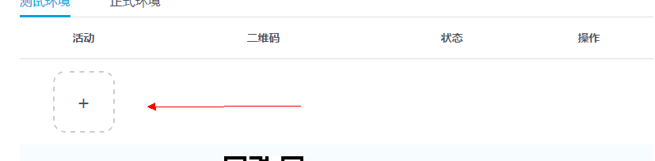

# 活动测试环境和正式环境

### 活动前端静态资源

开发者在模拟器上完成开发后，将html页面，css文件，前端js脚本等，按zip格式打包成一个zip包，称为**页面资源压缩包**。

### 活动后台逻辑资源

逻辑资源包括两个文件：

- logic.js
	开发者在模拟器的logic目录下的logic.js文件。

- config.json
	开发者在模拟器的data目录下的config.json文件。

请将这两个文件（不要嵌套目录，直接选择这两个文件压缩），按zip格式打包成一个zip包，称为**后台资源压缩包**。

### 创建活动并部署现网测试

1.用已认证的qq账户登录hudong.qq.com
2.点击游戏管理到游戏管理页面后点击活动tab
3.点击添加活动按钮

4.填写活动相关信息，并点击提交，创建完活动

