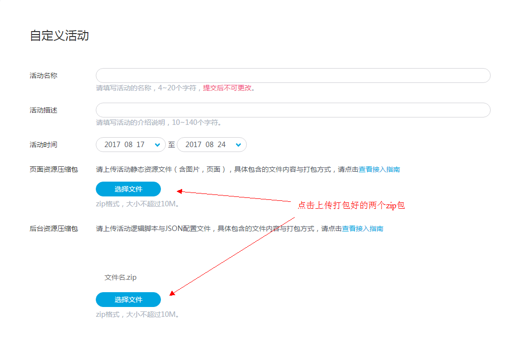
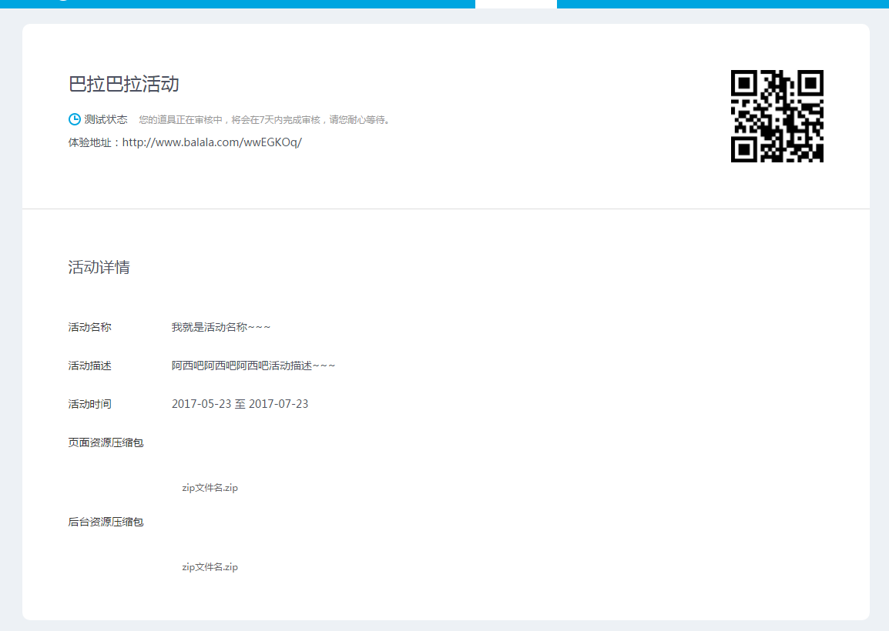

#从模拟器到上线活动的流程

### 从模拟器到上线流程
1. 在本地开发完成
2. 将public文件夹打包成页面资源压缩包,将logic.js和config.json打包成后台资源压缩包
3. 
4. 等活动状态变为测试状态（前期会经过处理中状态，资源需要等待验证通过后才能放入测试环境）

5. 在测试环境验证:浏览器登录体验地址验证测试环境是否成功

6. 点击活动上线，等待活动变成上线状态，活动正式发外网