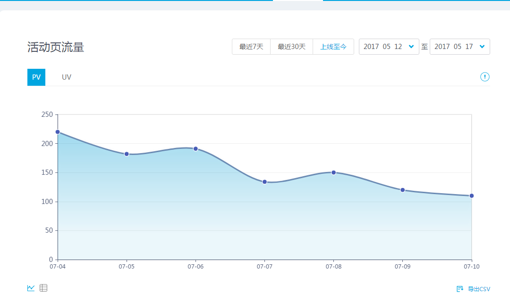
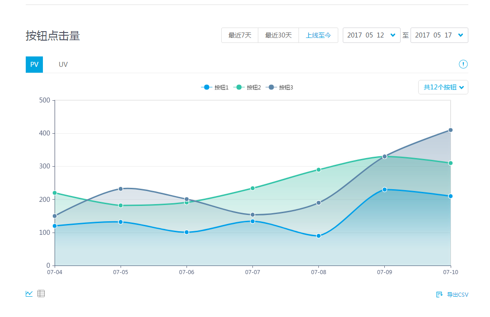

### 前端点击按钮流量监控
互动平台提供对前端最多16个按钮的监控，只需要标注需要监控的按钮

在按钮的DOM中加入属性data-seed="btn**",**为按钮的标识取值范围为1-16
```html
<button data-seed="btn1">按钮一</button>
```
### 查看活动数据 ###
在互动平台上查看页面流量和按钮点击数据



## 自动唤起手q
在**正式环境**页面，在非手q环境下打开活动页面，会自动唤起手q,然后打开活动页.在模拟器和测试环境中页面不会自动唤起.

## 对于前端报错进行监控
当前端发生脚本错误，会对报错进行收集，然后展示在互动游戏平台数据监控内