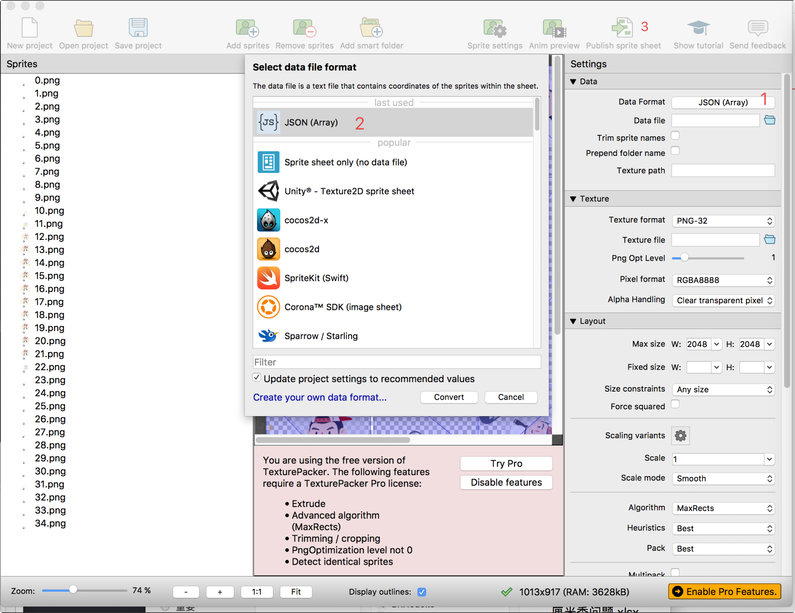

# 2.21 BK.SpriteSheetCache 
>图集
>
>调用前请主动加载spriteSheetCache.js

### 方法 
#### loadSheet(jsonPath,pngPath)

> 加载图集

 参数  | 类型 |名称 | 备注
------------- | ------------- | -------------| -------------
jsonPath | string | 图集json文件路径 | 
pngPath | string | 图集png文件路径 | 

例子：

```
//加载图集
var texPath = "GameRes://texture/spritesheet/test.png";
var jsonPath = "GameRes://texture/spritesheet/test.json";
BK.SpriteSheetCache.loadSheet(jsonPath,texPath);
```

#### removeSheet(jsonPath,pngPath)

> 移除图集

 参数  | 类型 |名称 | 备注
------------- | ------------- | -------------| -------------
jsonPath | string | 图集json文件路径 | 
pngPath | string | 图集png文件路径 | 

例子：

```
//移除图集
var texPath = "GameRes://texture/spritesheet/test.png";
var jsonPath = "GameRes://texture/spritesheet/test.json";
BK.SpriteSheetCache.removeSheet(jsonPath,texPath);
```

#### getTextureByFilename(filename)
> 根据图集文件中某个文件的名字获取纹理

 参数  | 类型 |名称 | 备注
------------- | ------------- | -------------| -------------
filename | string | 图集文件中某个文件的名字 | 

返回值：

 类型 |名称 | 备注
------------- | ------------- | -------------
 BK.Texture | BK.Texture对象 |


例子：

```
var texture   = BK.SpriteSheetCache.getTextureByFilename("green_btn.png");
```

#### getFrameInfoByFilename(filename)
> 根据图集文件中小图名称，获取小图的位置信息

 参数  | 类型 |名称 | 备注
------------- | ------------- | -------------| -------------
filename | string | 图集文件中小图的名字 | 

返回值：

 类型 |名称 | 备注
------------- | ------------- | -------------
 Object | 小图位置信息 |


例子：

```
var frameInfo = BK.SpriteSheetCache.getFrameInfoByFilename("green_btn.png");
var w = frameInfo.frame.w; //具体小图的宽
var h = frameInfo.frame.h; //具体小图的高
var x = frameInfo.frame.x; //具体小图在大图中的x
var y = frameInfo.frame.y; //具体小图在大图中的y

```


#### getTextureFrameInfoByFileName(filename)
> 根据图集文件中小图名称，获取小图的位置信息和纹理对象

 参数  | 类型 |名称 | 备注
------------- | ------------- | -------------| -------------
filename | string | 图集文件中小图的名字 | 

返回值：

 类型 |名称 | 备注
------------- | ------------- | -------------
 Object | 小图的位置信息和纹理对象 |
 
 
例子：

```
var textureInfo = BK.SpriteSheetCache.getTextureFrameInfoByFileName("green_btn.png");
var frameInfo = textureInfo.frameInfo;
var w = frameInfo.frame.w; //具体小图的宽
var h = frameInfo.frame.h; //具体小图的高
var x = frameInfo.frame.x; //具体小图在大图中的x
var y = frameInfo.frame.y; //具体小图在大图中的y

var texPath =  textureInfo.texturePath; //纹理路径

```


#### getTexturePathByFilename(filename)
> 根据图集文件中小图名称，获取大纹理路径名称

 参数  | 类型 |名称 | 备注
------------- | ------------- | -------------| -------------
filename | string | 图集文件中小图的名字 | 

返回值：

 类型 |名称 | 备注
------------- | ------------- | -------------
 string| 纹理路径名称 |


例子：


### 例子
查看 script/demo/render/spriteSheetCache_demo.js


##打包方法
引擎中使用TexturePacker作为打包工具
### 1.添加图片文件
将帧图片拖拽到TexturePacker中

### 2.输出文件
此处需要说明的是Data Format必须选择JSON Array

然后点选Public sprite sheet输出文件
### 3.调用加载
```
BK.Script.loadlib('GameRes://script/core/render/animatedSprite.js');

//DEMO
var texPath = "GameRes://texture/spritesheet/hello.png";
var jsonPath = "GameRes://texture/spritesheet/hello.json";
BK.SpriteSheetCache.loadSheet(jsonPath, texPath);
var textureInfoArr = new Array();
for (var i = 0; i < 35; i++) {
    var  name = i+'.png';
    var textureInfo = BK.SpriteSheetCache.getTextureFrameInfoByFileName(name);
    textureInfoArr.push(textureInfo);
}
var aniSp = new BK.AnimatedSprite(textureInfoArr);
aniSp.anchor = { x: 0.5, y: 0.5 };
aniSp.size = { width: 200 * 2, height: 214 * 2 };
var scrSize = BK.Director.screenPixelSize;
aniSp.position = { x: scrSize.width / 2.0, y: scrSize.height / 2.0 };
BK.Director.root.addChild(aniSp);

aniSp.delayUnits = 0.5;//设置每一帧持续时间，以秒为单位。默认1/30秒
// aniSp.paused = true;
aniSp.play(); //
```
