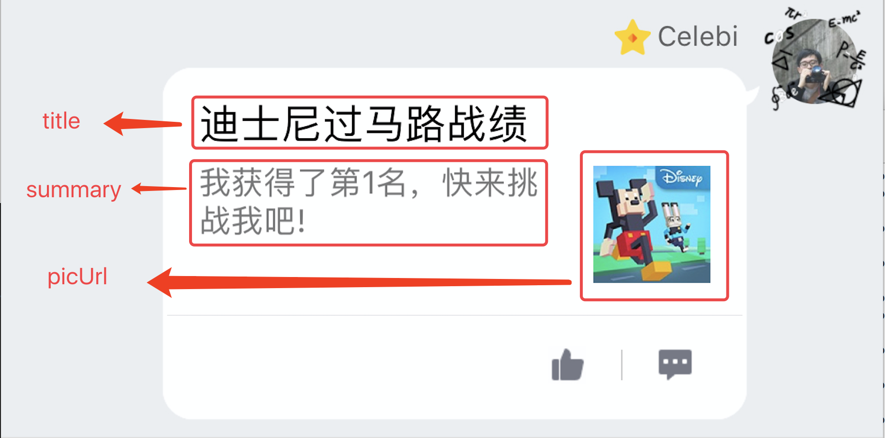

# 2.18 BK.QQ 房间手Q消息管理类
>本类用于与手q进行消息交换
>
>调用前请主动加载protocol.js


### 方法
#### notifyHideGame()
>通知手q,用户点击了缩小按钮

参数：无
返回值：无

#### notifyCloseGame()
>通知手q,用户点击了关闭按钮

参数：无
返回值：无


#### notifyReadyGame()
>通知手q,游戏即将开始

参数：无
返回值：无


#### notifyGameTipsWaiting()
>通知手q,等待玩家加入

参数：无
返回值：无


#### notifyGameTipsSomeOneJoinRoom(nick)
>通知手q,新玩家加入房间

参数：

参数  | 类型 |名称 | 备注
------------- | ------------- | -------------| -------------
nick | string | 昵称 | 
返回值：无

#### notifyGameTipsSomeOneLeaveRoom(nick)
>通知手q,玩家离开房间

参数：

参数  | 类型 |名称 | 备注
------------- | ------------- | -------------| -------------
nick | string | 昵称 | 
返回值：无


#### notifyGameTipsPlaying()
>通知手q,游戏进行中

参数：无
返回值：无


#### notifyGameTipsGameOver()
>通知手q,游戏已结束

参数：无
返回值：无


#### inviteFriend(wording)
>邀请好友加入游戏。支持手q/微信

参数：

参数  | 类型 |名称 | 备注
------------- | ------------- | -------------| -------------
wording | string | 文案 | 
返回值：无


#### checkPubAccountState(puin,callback)
>查询是否关注公众号

参数：

参数  | 类型 |名称 | 备注
------------- | ------------- | -------------| -------------
puin | string | 公众号id | 
callback | function |回调函数| 
返回值：无

例子

```
BK.QQ.checkPubAccountState(pubAccountId ,function(errCode, cmd, data) {
      BK.Script.log(0,0," callback errCode = "+errCode+ " cmd = "+ cmd + " data = "+ data);
      if(data.is_follow == 1){ //1已关注 0未关注
         
      }
  });
```

#### enterPubAccountCard(puin)
>进入公众号资料卡

参数：

参数  | 类型 |名称 | 备注
------------- | ------------- | -------------| -------------
puin | string | 公众号id | 


返回值：无


#### reqCustomLogic(data,callback)
>开放api

参数：

参数  | 类型 |名称 | 备注
------------- | ------------- | -------------| -------------
data | json | 用户数据 | 
callback |function| 回调函数|

返回值：无

例子

	BK.Script.loadlib('GameRes://script/core/net/protocol.js');
	var data ={"gameid":2003, "data" : {"cmd" : "addex", "itemid" : 2025, "num" : 4}};
	BK.QQ.reqCustomLogic(data,function(errCode,cmd,data)
	{
	BK.Script.log(0, 0, "BK.QQ.reqCustomLogic errCode = " + errCode + " cmd = " + cmd + " data = " + JSON.stringify(data));
	
	})
	

#### uploadData(actionName,enter,result,param1,param2,pram3)

> 数据上报
> 


参数：

参数  | 类型 |名称 | 备注
------------- | ------------- | -------------| -------------
action | string | 操作id，用来定义操作 |
enter | number | 定义操作场景 |
result | number | 定义操作结果 |
param1 | string | 拓展字段 |
param2 | string | 拓展字段 |
param2 | string | 拓展字段 |

返回值：无

例子：

```
BK.Script.loadlib("GameRes://protocol.js")
var actionName = "actionname"
var enter = 1;
var result = 1;
var param1 = "param111"
var param2 = "param222"
var param3 = "param333"
BK.QQ.uploadData(actionName,enter,result,param1,param2,param3);
```

#### getGameItemList(callback)
> 获取游戏所有道具

参数：

参数  | 类型 |名称 | 备注
------------- | ------------- | -------------| -------------
callback | Function | 回调函数 |

返回值：无

例子：

```
BK.QQ.getGameItemList(function(errCode,cmd,data){
    BK.Script.log(0,0," reveive sso cmd = "+ cmd)
    var itemList = [];
    if(data){
        if(data.data){
            if(data.data.itemList){
                data.data.itemList.forEach(function(element) {
                    var item = {    
                     "id":element.id,               //道具ID 
                     "name":element.name,           //道具名称
                     "consumed":element.consumed,   //是否消耗型【0-非消耗型 1-消耗型】
                     "uinque":element.uinque,       //是否绝版【0-非绝版，1-绝版】
                     "iconUrl":element.iconUrl,     //素材iconurl
                     "curreInfo":element.curreInfo  //价格数组 因支持多货币，每个元素为某种货币的价格
                    //  "curreInfo":[
                    //                     {
                    //                     "curreType":3,    //3-游戏点券 4-二级货币（暂不能用）
                    //                     "price":1000     //价格
                    //                     }]    
                     }
                    itemList.push(item);
                    BK.Script.log(0,0,"id ="+ item.id + " name="+item.name+ " consumed="+item.consumed+" unique="+item.uinque+ " iconUrl="+item.iconUrl + " curreInfo="+item.curreInfo) ;   
                }, this);
            }
        }
    }
})
```

#### getUserGameItems(callback)
>获取当前用户拥有的游戏道具

参数：

参数  | 类型 |名称 | 备注
------------- | ------------- | -------------| -------------
callback | Function | 回调函数 |

返回值：无

例子：

```
BK.QQ.getUserGameItems(function(errCode,cmd,data){
    BK.Script.log(0,0," reveive sso cmd = "+ cmd)
    var itemList = [];
    if(data){
        if(data.data){
            if(data.data.itemList){
                data.data.itemList.forEach(function(element) {
                                            var item = {
                                                "consumed": element.consumed, //是否消耗型 【0-非消耗型 1-消耗型】
                                                "iconUrl":  element.iconUrl,  //素材iconurl
                                                "id": element.id,             //道具ID
                                                "name": element.name,         //道具名称
                                                "num": element.num            //活动获得道具数
                                            }
                                            itemList.push(item);
                                            BK.Script.log(0,0,"consumed="+ item.consumed + " iconUrl="+item.iconUrl + " id="+item.id + " name="+item.name + " num="+item.num) ;   
                                        }, this);
            }
        }
    }
});
```

#### buyGameItems(currencyType,callback)
>购买道具

参数：

参数  | 类型 |名称 | 备注
------------- | ------------- | -------------| -------------
currencyType | number | 货币类型 |3-游戏点券 4-二级货币（暂不能用）
itemIdList | Array | 道具列表 |
callback | Function | 回调函数 |

返回值：无

例子：

```
var curreType = 3;                   //3-游戏点券 4-二级货币（暂不能用）
var itemIdList = [                    //购买的道具列表
　　     { 
　　         "id":456,         //道具ID
　　         "num":10          //道具数量
　　     }
　　     ,{ 
　　         "id":123,         //道具ID
　　         "num":1           //道具数量
　　     }
　　]
}

BK.QQ.buyGameItems(curreType,itemIdList,function(errCode,cmd,data){
    BK.Script.log(0,0," reveive sso cmd = "+ cmd + " errCode = "+errCode)
    var itemList = [];
    if(data){
        if(data.data){
            //游戏ID
            if (data.data.gameId) {
                BK.Script.log(0,0,"gameId = "+data.data.gameId);
            }
            //使用的货币
            if (data.data.curreType) {
                BK.Script.log(0,0,"curreType = "+data.data.curreType);
            }
            //剩余货币
            if (data.data.currency) {
                BK.Script.log(0,0,"currency = "+data.data.currency);
            }
            //购买的道具列表
            if(data.data.itemList){
                data.data.itemList.forEach(function(element) {
                    var item = {    
                     "id":element.id,             //道具ID 
                     "num":element.num,           //道具名称
                     }
                    itemList.push(item);
                    BK.Script.log(0,0,"id ="+ item.id + " num="+item.num) ;   
                }, this);
            }

            //道具鉴权错误, 无错误时无此字段
            if (data.data.authRet) {
                var authRet = data.data.authRet;
                var failId = authRet.id; //道具ID
                var failRet = authRet.ret;//错误码   
                BK.Script.log(0,0,"authRet failId="+ failId + " failRet="+failRet) ; 
            }
        }
    }
});
```


#### getRoomUserScoreInfo(roomId,callback)
>获取房间内的用户成绩数据

参数：

参数  | 类型 |名称 | 备注
------------- | ------------- | -------------| -------------
roomId | number | 房间id |
callback | Function | 回调函数 |

返回值：无

例子：

```
var  roomId =  123;      //房间ID
BK.QQ.getRoomUserScoreInfo(data,function(errCode,cmd,data){
     if(data.data){
        var userRank = data.data.userRank;
        for (var idx = 0; idx < userRank.length; idx++) {
            var singleUserRank = userRank[idx];
            var openId = singleUserRank.openId;
            var score  = singleUserRank.score;
            var rank   = singleUserRank.rank;
            //可选
            // var a1 = singleUserRank.a1;
            // var a2 = singleUserRank.a2;
            // ...
            //
        }
     }
});
```

#### scoreUpload(scoreData,arkData,callback) 
> 成绩上报
> 
> 使用场景：玩家中途退出游戏，玩家最终完成游戏，均需要主动上报成绩。


参数：

参数  | 类型 |名称 | 备注
------------- | ------------- | -------------| -------------
scoreData | Object | 请求参数 | 具体属性如下例子
arkData | Object | ark控制参数 | 手Q 7.3.5新增支持定制化结果气泡界面。如不需要定制，填null/undefined
callback | Function | 回调函数 | 具体错误码可在 <a href:https://hudong.qq.com/docs/engine/api/BK.MQQ.ErrorCode.html>这里</a>查看

返回值：无

例子：

```
var scoreData = [
　　     {
        //第一个用户的得分
　　         "openId":"4558665DATRGFGFS455",
　　         "scoreInfo":{
                "score":4455,   //用户得分  必须上报
                //附加参数，上报和使用都由第三方决定，最多支持5个附加参数，可选
                "a1":1,
                "a2":2,
　　               },
　　          "actInfo":{     //活动数据由第三方配置定义，key值统一用p1,p2,...此数据只用于活动，不会保存到用户的房间数据里, 现支持最多支持16个
　　                   "p1":1,    //参数0
　　                   "p2":5,    //参数1
　　              },
　　     },
    {
            //第二个用户的得分
　　         "openId":"SDJIIWJIEQWJ232389DA",
　　         "scoreInfo":{
                "score":4455,   //用户得分  必须上报
                //附加参数，上报和使用都由第三方决定，最多支持5个附加参数，可选
                "a1":1,
                "a2":2,
　　               },
　　          "actInfo":{     //活动数据由第三方配置定义，key值统一用p1,p2,...此数据只用于活动，不会保存到用户的房间数据里, 现支持最多支持16个
　　                   "p1":1,    //参数0
　　                   "p2":5,    //参数1
　　              },
    }
    //第n个用户的得分 ...
];


//735新加，支持各模式玩游戏
var arkData = {
    /**模式一**/
    "pkMode":1,                    //pk模式 1-PVP  2-PVE
    "wording":"胜利",             //结果展示wording
    "groupInfo":
    [
        {
        "rank":1,                     //组排名，如有并列第一的则两组的rank都是1
        "openIds":["4558665DATRGFGFS455","SDJIIWJIEQWJ232389DA"],         //组成员openId
        "grpWording":                       //组 wording，可选
        [
        ["得分","123","分" ],
        ["用时","123","秒" ],
        ["杀怪","123" ],
        ]
        }
        ]
}
BK.QQ.scoreUpload(scoreData,arkData,function(err,cmd,data){
    //errCode ，0表示成功其他为异常
    //data = {}
});
```


#### shareToMQQ(title, summary, detailUrl, picUrl)
> 分享游戏至手Q
> 

参数：

参数  | 类型 |名称 | 备注
------------- | ------------- | -------------| -------------
title | string | 标题 | 
summary | string | 分享内容 | 
detailUrl | string | 跳转详情url | 游戏方提供 
picUrl | string |  图片url | 游戏方提供

返回值:无

以迪斯尼过马路中的分享为例，具体参数对应的显示如下，点击后，将跳转至 detailUrl对应的地址


例子：

```
BK.QQ.shareToMQQ("迪斯尼过马路战绩","我获得了第1名，快来挑战我","www.xxx.com","xxx.com/xx.png");
```

### getCmshowDressInfo(openId,callback)
> 获取厘米秀形象数据

参数：

参数  | 类型 |名称 | 备注
------------- | ------------- | -------------| -------------
openId | string | 待获取人的openid | 


返回值:无

例子：

```
//根据openId 获取厘米秀装扮
BK.QQ.getCmshowDressInfo(GameStatusInfo.openId,function(errCode,cmd,data){
	BK.Script.log(0,0,"cmd = "+ cmd + " data = " + data);
	if(errCode == 0){
	    var jPath = BK.Script.pathForResource(data.skltPath.atlas, 'json');
	    var aPath = BK.Script.pathForResource(data.skltPath.json, 'atlas'); 
	    var ani =new BK.SkeletonAnimation(aPath, jPath, 1,null,null,null );
	    for (var i=0;i<data.dressPath.length;i++)
	    {
	        var j = data.dressPath[i].atlas;
	        var a = data.dressPath[i].atlas;
	        var jPath = BK.Script.pathForResource(j, 'json');
	        var aPath = BK.Script.pathForResource(a, 'atlas');
	        ani.setAccessory(jPath, aPath);
	    }
	    ani.position = {x:100,y:100};
	    BK.Director.root.addChild(ani);
	}
});
```

