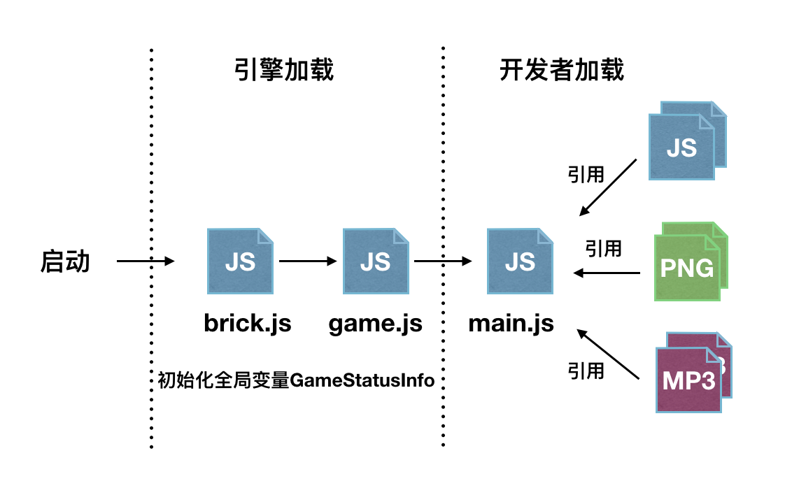

## 开发概况

<font color=#ff0000>如遇ios11的模拟器卡顿，建议将模拟器版本降级到10.3.1</font>

###Helloworld程序
开门见山，通过一个helloworld程序来学习下bricks引擎。

修改PublicBrickEngineGame/PublicBrickEngineGame/Res/main.js 为如下代码，并运行构建。

下面例子是第一步生成纹理对象，第二步使用纹理对象生成精灵实例，第三步将精灵对象加入到渲染树的根节点进行渲染。

```
//1.创建一个纹理
var tex = new BK.Texture('GameRes://texture/test.png');  
//2.创建一个精灵对象 
var  sp = new BK.Sprite(100,100, tex,0,1,1,1);
//3.加入到根节点
BK.Director.root.addChild(sp);
```

###接口命名
brick引擎中所有的接口均为BK对象的属性
如 BK.Director，BK.Sprite等

###脚本加载流程

引擎启动后，会加载brick.js与game.js脚本，运行完成后，加载开发者编写入口脚本main.js。

对于开发者而言，无需关心brick.js与game.js的加载逻辑。开发者进行游戏打包时，也只需打包引用到的脚本与资源。

工程提供了一些基础的组件与类库，开发者若需引用需主动调用`BK.Script.loadlib`进行加载，**引擎除了加载brick.js与game.js外不会加载其他组件**。



### 全局变量GameStatusInfo
游戏启动后，引擎会为开发者写入名为GameStatusInfo的有关游戏的全局参数

```
GameStatusInfo = {
    "svrIp" : "14.17.42.125",       //游戏推荐ip。开发者可忽略
    "gameVersion" : "408.2",   //游戏版本号
    "isMaster" : 1,		            //是否房主，1房主，0参加者
    "dressPath" : [			    //厘米秀衣服路径
                   {
                   "atlas" : "\/Clothes\/1\/playRes\/dress",
                   "json" : "\/Clothes\/1\/playRes\/dress"
                   },
                   {
                   "atlas" : "\/Clothes\/2\/playRes\/dress",
                   "json" : "\/Clothes\/2\/playRes\/dress"
                   },
                   {
                   "atlas" : "\/Clothes\/3\/playRes\/dress",
                   "json" : "\/Clothes\/3\/playRes\/dress"
                   },
                   {
                   "atlas" : "\/Clothes\/4\/playRes\/dress",
                   "json" : "\/Clothes\/4\/playRes\/dress"
                   },
                   {
                   "atlas" : "\/Clothes\/5\/playRes\/dress",
                   "json" : "\/Clothes\/5\/playRes\/dress"
                   },
                   {
                   "atlas" : "\/Clothes\/6\/playRes\/dress",
                   "json" : "\/Clothes\/6\/playRes\/dress"
                   },
                   {
                   "atlas" : "\/Clothes\/7\/playRes\/dress",
                   "json" : "\/Clothes\/7\/playRes\/dress"
                   }
                   ],
    "gameId" : 3,          //游戏id
    "networkType" : 0,  //网络类型 1 电信 ，2 联通 ，3 移动  0: wifi或未知
    "roomId" : "0",          //房间号
    "platform" : "ios",    //平台类型
    "openId" : "72ED98114FE0D68FD23650B303B8AD80",  //当前用户的标识
    "spriteDesignHeight" : 368,   //厘米秀小人spine动画的设计高度
    "QQVer" : "7.1.0.0",		//手机qq版本
    "isFirstPlay" : 1,			//是否第一次玩
    "skltPath" : {			//厘米秀小人spine骨骼
        "atlas" : "\/Role\/0\/playRes\/role",
        "json" : "\/Role\/0\/playRes\/role"
    }
```

###资源路径
脚本中访问脚本或者图片资源时，需以前缀+相对路径的形式进行访问。

游戏中仅有两种资源路径，资源包所在的路径，手Q根据游戏ID分配的沙盒路径。

资源包所在的路径以GameRes://开头，对应的路径为main.js所在的路径。只可读不可写。

沙盒路径以GameSandBox://开头，文件可读可写。可用于存储游戏的存档信息等。

例如有如下的游戏包:
	 
	 |--main.js
	   |--res
	   	 |--img1.png
	   	 |--img2.png
	   |--lib
	   	 |--script1.js
	   	 |--script2.js
	 
	 当需要访问 /lib/script1.js，使用路径为 GameRes://lib/script1.js
	 
### 加载文件
bricks引擎不支持AMD和CommonJS加载方式。加载其他js文件如下

```
BK.Script.loadlib("GameRes://lib/script1.js")
```

### 错误调试

通过查询log关键字 "Execute JS Error" 可以查询到执行错误的行数和列数，以及文件的具体位置

###坐标系与单位
bricks引擎中的坐标系与opengl的坐标系一致。坐标原点在屏幕的左下角，x轴正方向向右，y轴正方向上。 且引擎中所有数值均为**实际像素**。