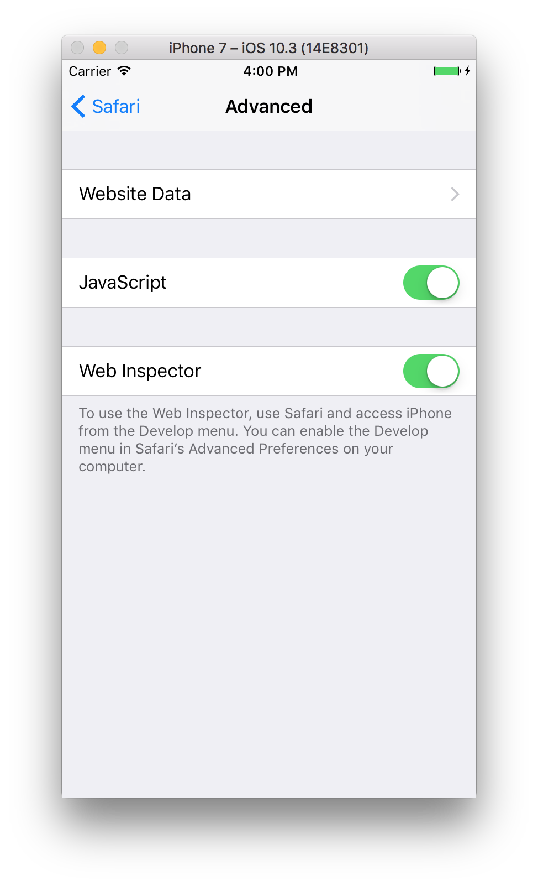
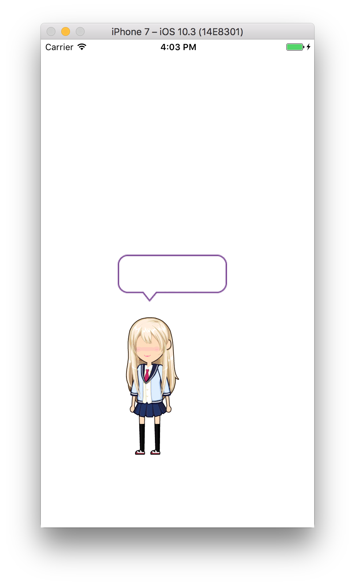
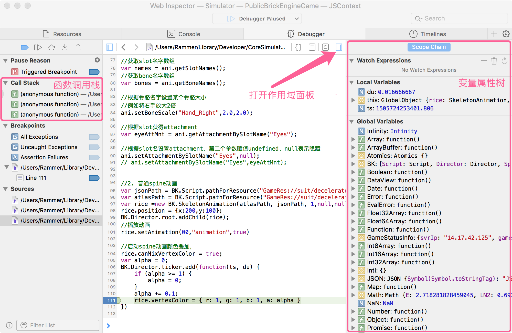
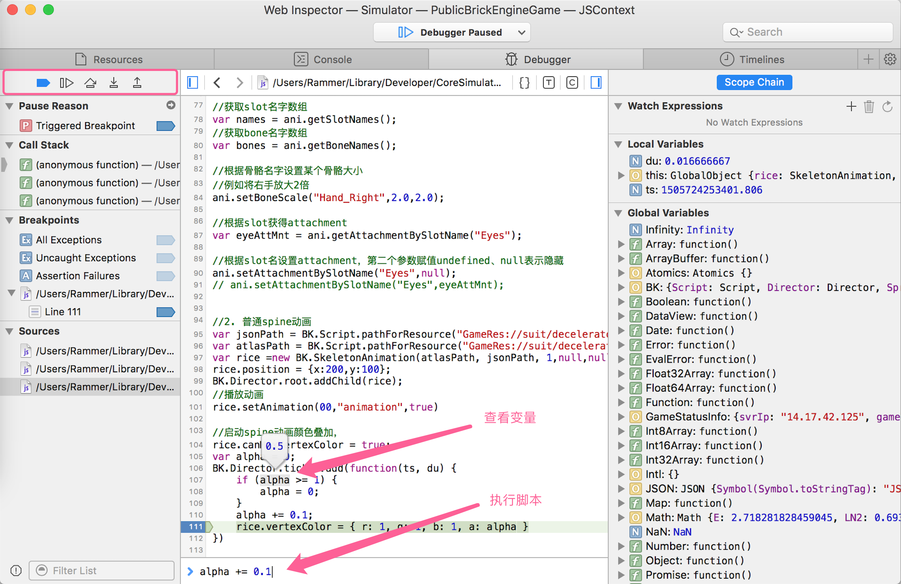
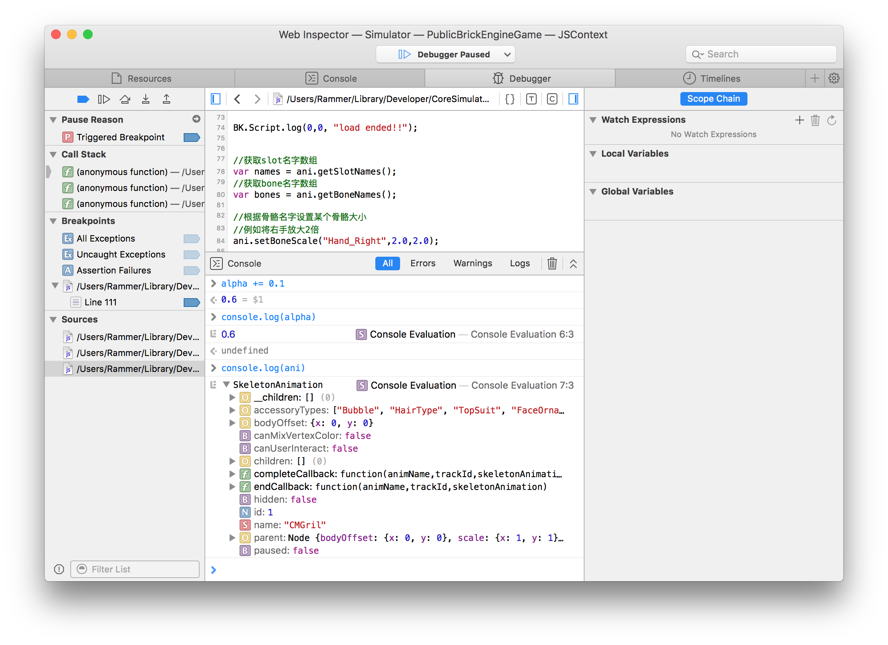

# Safari远程调试游戏

### 1. 打开电脑端Safari的开发者模式

【设置】->【高级】-> 勾选『在“菜单栏显示“开发”菜单』

### 2. 打开模拟器/真机的开发者模式

【设置】->【Safari】->【高级】-> 打开『Web检查器』

### 3. 在模拟器/真机运行游戏工程（真机连接USB）

运行游戏后，

打开Safari的开发菜单，可以看到有模拟器/真机设备列出。（如果没有设备列出，请检查前面步骤的设置后**重启Safari**，或重新运行游戏工程）

在模拟器（Simulator）的展开菜单中选择工程（PublicBrickEngineGame）对应的JSContext，就会出现调试面板

### 4. 断点调试

在Debugger选项卡中，从左侧源文件列表双击打开文件，在打开的文件左侧点击行号可以添加断点。

代码执行到断点位置游戏会暂停运行，在左侧可以看到函数调用栈，点击右上角打开作用域面板开关可以看到断点所在作用域内的局部变量和所有全局变量。

通过左上方的控制按钮可以控制单步调试。
将鼠标悬浮在变量上，可以看到变量的具体信息，在下方输入框可以直接输入脚本执行，甚至修改变量的值

可以通过console.log打印变量查看变量属性，console.log会输出到Safari的控制台，BK.Script.log会输出到XCode控制台。（注意不要操作非js对象如console.log(BK)，否则会出现未定义错误）

### 5. js异常

当js代码发生异常时，控制台会打印出具体的错误信息，可以定位对应文件的错误行。

