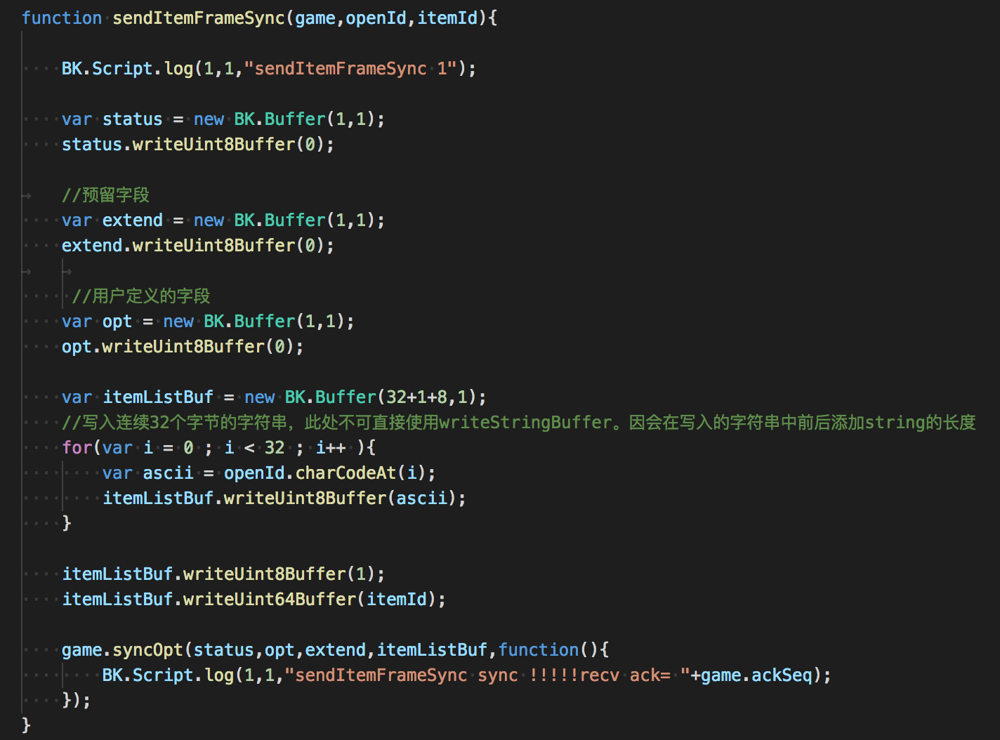
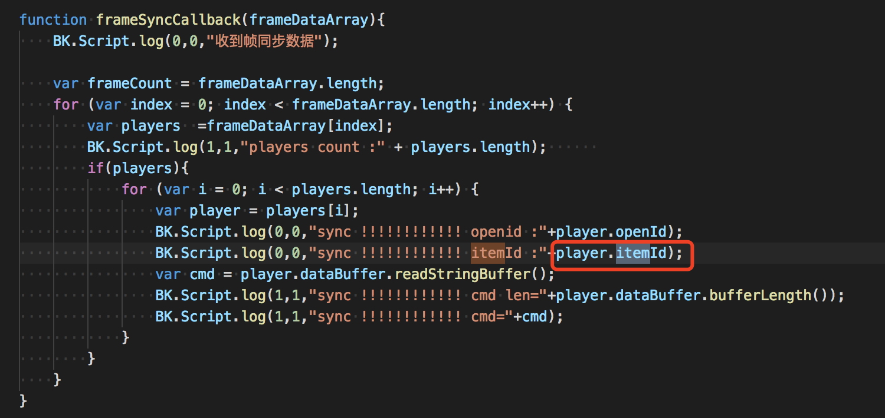

# 3.1 道具

## 获取游戏所有道具

```
BK.QQ.getGameItemList(function(errCode,cmd,data){
    BK.Script.log(0,0," reveive sso cmd = "+ cmd)
    var itemList = [];
    if(data){
        if(data.data){
            if(data.data.itemList){
                data.data.itemList.forEach(function(element) {
                    var item = {    
                     "id":element.id,               //道具ID 
                     "name":element.name,           //道具名称
                     "consumed":element.consumed,   //是否消耗型【0-非消耗型 1-消耗型】
                     "uinque":element.uinque,       //是否绝版【0-非绝版，1-绝版】
                     "iconUrl":element.iconUrl,     //素材iconurl
                     "curreInfo":element.curreInfo  //价格数组 因支持多货币，每个元素为某种货币的价格
                    //  "curreInfo":[
                    //                     {
                    //                     "curreType":3,    //3-游戏点券 4-二级货币（暂不能用）
                    //                     "price":1000     //价格
                    //                     }]    
                     }
                    itemList.push(item);
                    BK.Script.log(0,0,"id ="+ item.id + " name="+item.name+ " consumed="+item.consumed+" unique="+item.uinque+ " iconUrl="+item.iconUrl + " curreInfo="+item.curreInfo) ;   
                }, this);
            }
        }
    }
})
```


## 获取用户拥有的游戏道具

通过调用下方代码可以获取当前用户的道具信息

```
var data = {
    "from": "ios",  //描述请求来源或场景 h5.xxx.yyy/ios.xxx.yyy/android.xxx.yyy 用于后台统计
    "gameId":3,
    "openId":"DASGTERDF126556365"
}
	
BK.QQ.getUserGameItems(data,function(errCode,cmd,data){
    BK.Script.log(0,0," reveive sso cmd = "+ cmd)
    var itemList = [];
    if(data){
        if(data.data){
            if(data.data.itemList){
                data.data.itemList.forEach(function(element) {
                                            var item = {
                                                "consumed": element.consumed,
                                                "iconUrl":  element.iconUrl, 
                                                "id": element.id, 
                                                "name": element.name, 
                                                "num": element.num
                                            }
                                            itemList.push(item);
                                            BK.Script.log(0,0,"consumed="+ item.consumed + " iconUrl="+item.iconUrl + " id="+item.id + " name="+item.name + " num="+item.num) ;   
                                        }, this);
            }
        }
    }
})
```

## 购买道具

```
var itemID = 2025;
var itemNum = 20;

var data =  {
    "from" : GameStatusInfo.platform,//描述请求来源或场景 h5.xxx.yyy/ios.xxx.yyy/android.xxx.yyy 用于后台统计
　　 "gameId":GameStatusInfo.gameId,  //游戏ID
    "curreType":3,                   //3-游戏点券 4-二级货币（暂不能用）
　　"itemIdList":[                    //购买的道具列表
　　     { 
　　         "id":itemID,           //道具ID
　　         "num":itemNum          //道具数量
　　     }
　　]
}
    
BK.QQ.buyGameItems(data,function(errCode,cmd,data){
    BK.Script.log(0,0," reveive sso cmd = "+ cmd + " errCode = "+errCode)
    var itemList = [];
    if(data){
        if(data.data){
            //游戏ID
            if (data.data.gameId) {
                BK.Script.log(0,0,"gameId = "+data.data.gameId);
            }
            //使用的货币
            if (data.data.curreType) {
                BK.Script.log(0,0,"curreType = "+data.data.curreType);
            }
            //剩余货币
            if (data.data.currency) {
                BK.Script.log(0,0,"currency = "+data.data.currency);
            }
            //购买的道具列表
            if(data.data.itemList){
                data.data.itemList.forEach(function(element) {
                    var item = {    
                     "id":element.id,             //道具ID 
                     "num":element.num,           //道具名称
                     }
                    itemList.push(item);
                    BK.Script.log(0,0,"id ="+ item.id + " num="+item.num) ;   
                }, this);
            }

            //道具鉴权错误, 无错误时无此字段
            if (data.data.authRet) {
                var authRet = data.data.authRet;
                var failId = authRet.id; //道具ID
                var failRet = authRet.ret;//错误码   
                BK.Script.log(0,0,"authRet failId="+ failId + " failRet="+failRet) ; 
            }
        }
    }
});

```
道具相关错误码请查阅 2.20.1 错误码
 
## 消耗道具

支持游戏进行时和游戏外消耗道具。

### 1.游戏进行外消耗道具

>用法：传入需要消耗的道具列表已经对应的数量，则可以使用道具
>
>消耗成功后，后台回吐消耗成功、失败的道具列表。如果消耗成功，则顺带返回一个流水号seq，用于标识此次消耗，此序列号可以用来进行回滚操作

```     
  var itemlist = [
{
    "id":1,    //道具id
    "num":1,   //数量
},                
{
    "id":2,    //道具id
    "num":1,   //数量
}
]
BK.QQ.consumeItems(itemlist,function(errCode,succList,failList){
if (errCode == 0) {
    for(var i = 0 ; i<succList.length; i++ ){
        //消耗成功的itemid
         var succItemInfo = succList[i];
        var id = succItemInfo.id; //道具ID
        var seq = succItemInfo.seq; //用于标识当前消耗的流水号
       
    }
    for(var i = 0 ; i<failList.length; i++ ){
        //消耗失败的item
        var faldItemInfo = failList[i];
        var ret = faldItemInfo.ret; //失败返回码
        var id = faldItemInfo.id; //道具ID
    }
}
})
```

### 2.游戏进行时消耗道具。
需要以帧同步的方式发送至游戏后台后，进行校验，消耗成功后，游戏后台也以帧同步的方式推送至房间内的所有玩家


完整流程代码请看frameSync_demo.js，此处仅列出消耗代码

下例为向后台发送消耗道具帧同步消息




###注意点：
<font color=#ff0000>一帧中仅仅能消耗一个道具</font>

## 道具回滚
>当因网络、游戏逻辑需要等原因需要将已消耗的道具进行回滚，恢复到未消耗状态，可以使用本接口。
>
>用法:传入对应消耗的道具id消耗时对应的流水号seq，即可回滚某次消耗


```     
var itemlist = [
	{
	    "id":1,    //道具id
	    "num":1,   //数量
	    "seq":"12312"//消耗的流水号
	},                
	{
	    "id":2,    //道具id
	    "num":1,   //数量
	    "seq":"12312"//消耗的流水号
	}
]
BK.QQ.rollbackGameItems(itemlist,function(errCode,succList,failList){
	if (errCode == 0) {
	    for(var i = 0 ; i<succList.length; i++ ){
	        //回滚成功的itemid
         	 var succItemInfo = succList[i];
	        var id = succItemInfo.id; //道具ID
	    }
	    for(var i = 0 ; i<failList.length; i++ ){
	        //回滚失败的item
	        var faldItemInfo = failList[i];
	        var ret = faldItemInfo.ret; //失败返回码
	        var id = faldItemInfo.id; //道具ID
	    }
	}
})
```   