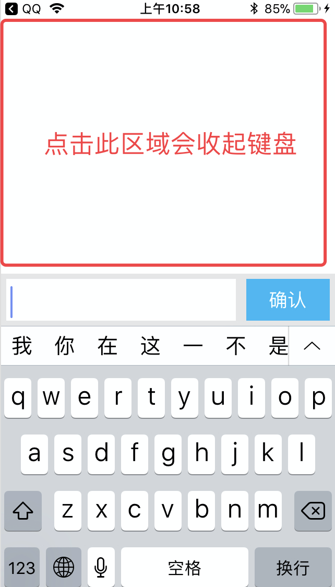
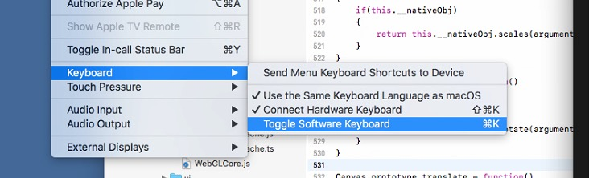

# 输入框

>最新支持版本手Q 7.3.5

### 使用方法
##### 1.调起键盘
使用BK.Editor.showKeyBoard即可调起键盘

```
function onTextChange(text){
	BK.Script.log(1,1,"xxxx text ="+text);
}

function onBtnClick(text){
	BK.Script.log(1,1,"xxxx onBtn click ="+text);
}

BK.Editor.showKeyBoard(onBtnClick,onTextChange);
```



##### 2.输入完毕确认
点击“确定“按钮时的触发回调函数（下例子中onBtnClick）
 
##### 3.检测输入文案改变
每当文案改变时，触发回调函数（下例子中onTextChange）

#### 4.收起键盘
点击键盘外的区域即可收起键盘（如上图红框）

### 例子：
`script/demo/ui/editor_demo.js`

### 其他注意事项

#### Xcode模拟器中无法拉起键盘
需要确认不勾选
模拟器 -> Hardware --> Keyboard->Toggle Sofeware Keyboard

