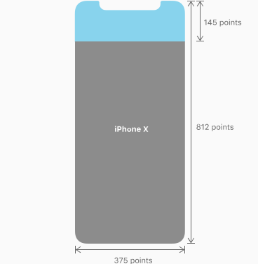

# 3.2 iPhoneX适配

为兼容新出的iPhoneX的设备，开发者需要单独对iPhoneX设备进行视觉兼容

##如何判断iPhoneX?

竖屏下iPhoneX 的宽高为 1125px * 2436px 

开发者需要
`GameStatusInfo.platform == "ios"` 和 `BK.Director.screenPixelSize`获得的宽高是否等于 1125与2436进行判断。

##设计要求
对于iPhoneX的设计要求有如下两点，开发者需按照以下两个要求进行兼容

###1.整体布局铺满屏幕

开发者需要确保游戏布局布满整个屏幕（如下图），需包含四方圆角，以及屏幕上方“额头”。即背景图需覆盖整个屏幕

###2.可点击的控件，都要在安全区内
根据苹果的设计规范，对于软件中的点击控件，都需放置在安全区内（safe area 下图绿色区域），安全区与屏幕边缘的边距如下

竖屏下

横屏下

> 参考网站
>
>https://developer.apple.com/ios/human-interface-guidelines/overview/iphone-x/
>https://designcode.io/ios11-iphone-x