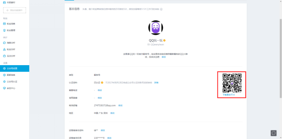
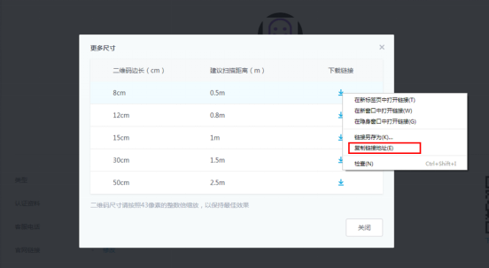
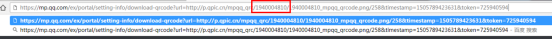

# 5.3 公众号

##查询是否关注公众号
<font color=#ff0000>前置条件：1.调用接口时需预先加载protocol.js 2.需已知PUIN</font>
 

其中 PUIN 传入须为string

```
var PUIN = "2878775916";
BK.QQ.checkPubAccountState(PUIN ,function(errCode, cmd, data) {
      BK.Script.log(0,0," callback errCode = "+errCode+ " cmd = "+ cmd + " data = "+ data);
      if(data.is_follow == 1){
          //已关注
      }else{
          //未关注
      }
  });    
```

##进入公众号主页

```
var PUIN = "2878775916";
BK.QQ.enterPubAccountCard(PUIN);
```

##获取PUIN

1、登录mp.qq.com进入服务号

2、进入公众号设置页，点击二维码下载更多尺寸

3、选择任意下载链接复制下载地址

4、复制到地址栏查看PUIN



