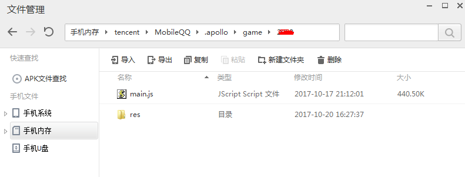
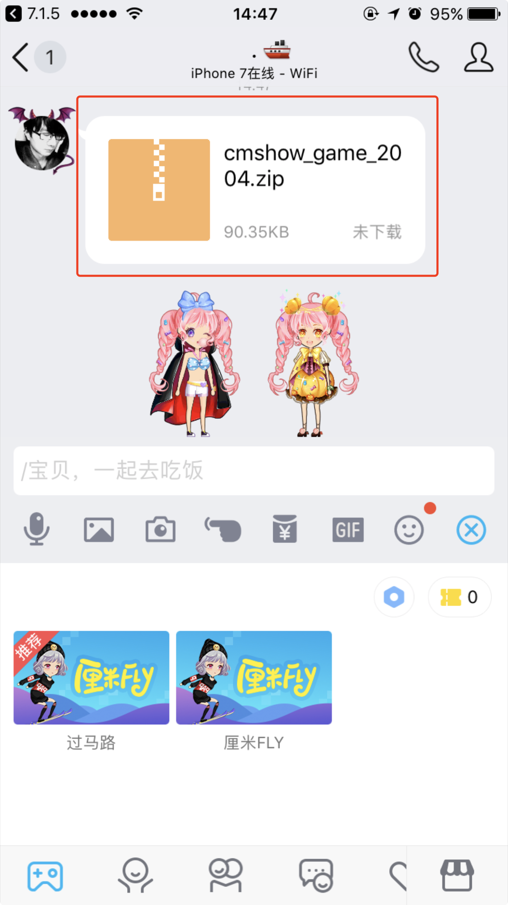
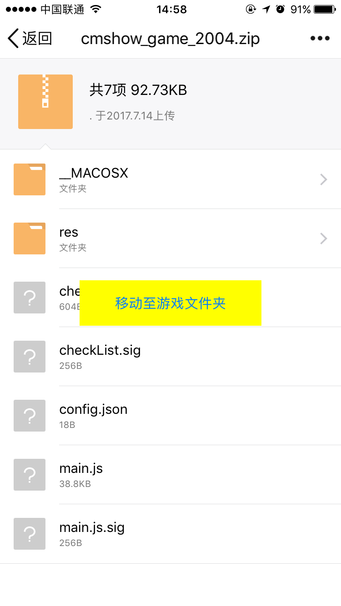
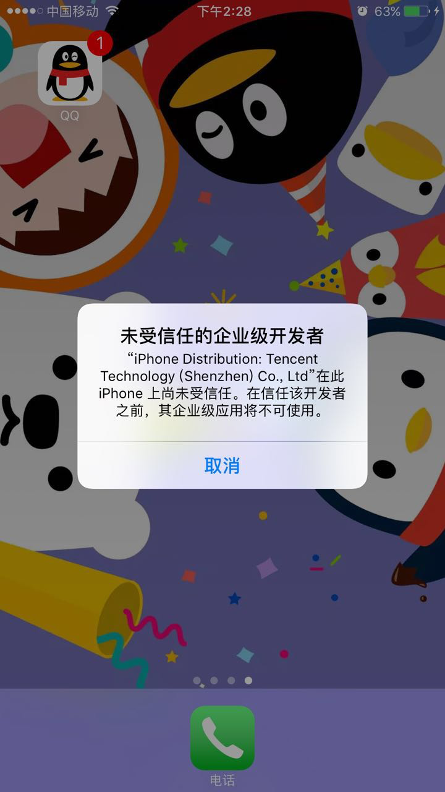

# 替换本地游戏

### Android版手Q替换方法
1. 关闭文件校验开关
  
  打开手Q->左抽屉->测试环境设置 将 厘米秀游戏文件验证开关 置为关闭状态
  
2. 本地替换文件

将设备USB连接电脑后，使用电脑端手机助手软件（如应用宝、91助手）,访问手机内存卡/tencent/MobileQQ/.apollo/game/xxx 。其中xxx对应游戏gameId。

将游戏包内容替换到该文件夹下即可。

注意意放置main.js位置必须放置正确。如gameId为1234,则必须确认main.js放置在/tencent/MobileQQ/.apollo/game/1234/main.js

### iPhone版手Q替换方法 
#### 1.安装手Q后，因需初始依赖一个cdn拉下来的一个版本配置，需先点击开始游戏，下载一个线上的游戏包
#### 2.将打包好的游戏包发送至聊天窗，并替换文件夹
点击气泡后，下载至本地后，点击“移动至游戏文件夹”

使用上述功能，调试手q为特殊版本，请联系对接产品同学获取手q包

特殊版本手Q安装指引

安装特殊版本手Q时，需确保

1.删除App Store版本的手Q

2.保持手机网络通畅

3.确保设备开启了ios的开发者模式。

可使用iTools等第三方软件进行安装，也可以使用xcode Window-Devices 并将ipa包拖拽至下方红框位置进行安装

如遇 “未信任的企业级开发者”弹窗提示，
 请跳转至 设置-通用-描述文件与设备管理   将Teccent Technology(XXX) 设置为信任

