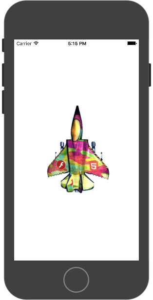

# 帧动画

帧动画需依赖图集类，使用前需先加载
`BK.Script.loadlib('GameRes://script/core/render/SpriteSheetCache.js');`

下面通过例子介绍帧动画

```
BK.Script.loadlib('GameRes://script/core/render/AnimatedSprite.js');
BK.Script.loadlib('GameRes://script/core/render/SpriteSheetCache.js');
var texPath = "GameRes://resource/texture//spritesheet/fighter.png";
var jsonPath = "GameRes://resource/texture//spritesheet/fighter.json";
//1.生成图集缓存对象 
var sheetCache = new SpriteSheetCache();
sheetCache.loadSheet(jsonPath, texPath);
//2.通过图集小图的名字，获取小图的纹理映射信息
var textureInfoArr = new Array();
for (var i = 0; i < 30; i++) {
    var val = i < 10 ? '0' + i : i;
    var textureInfo = sheetCache.getTextureFrameInfoByFileName('rollSequence00' + val + '.png');
    textureInfoArr.push(textureInfo);
}
//3.通过小图的纹理映射信息，创建帧动画对象，并设置位置信息（此处居于屏幕中央）
var aniSp = new AnimatedSprite(textureInfoArr);
aniSp.anchor = { x: 0.5, y: 0.5 };
aniSp.size = { width: 175 * 2, height: 240 * 2 };
var scrSize = BK.Director.screenPixelSize;
aniSp.position = { x: scrSize.width / 2.0, y: scrSize.height / 2.0 };
BK.Director.root.addChild(aniSp);
aniSp.delayUnits = 1 / 60; //设置每一帧持续时间，以秒为单位。默认1/30秒
aniSp.play(); //
//播放完一次的回调
aniSp.setCompleteCallback(function (ani, count) {
    BK.Script.log(0, 0, "setCompleteCallback count:" + count);
    // aniSp.paused = true;
});
//全部播放完的回调
aniSp.setEndCallback(function (ani, count) {
    BK.Script.log(0, 0, "setEndCallback count:" + count);
});
```



### 例子:
`BK.Script.loadlib("GameRes://script/demo/render/AnimateSpriteDemo.js");`