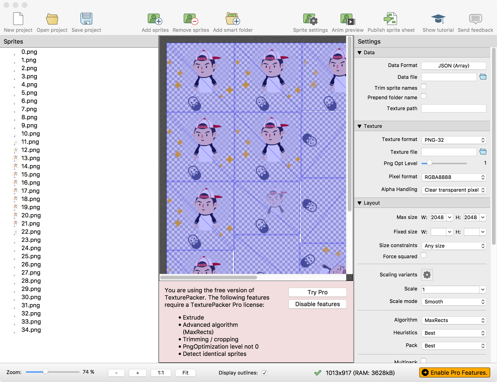

# 图集

## 1.使用图集生成精灵
打包方式，以及图集文件生成方法请看本文最下

使用图集预先加载

```
BK.Script.loadlib('GameRes://script/core/render/SpriteSheetCache.js');
```

加载图集文件

```
//加载图集
var texPath = "GameRes://resource/texture/spritesheet/test.png";
var jsonPath = "GameRes://resource/texture/spritesheet/test.json";
```

通过图集生成精灵对象

```
//1.通过图集生成精灵
var sp = sheetCache.createSheetSprite("icon.png",200,200);
if(sp){
    BK.Director.root.addChild(sp);
}
```

也可以通过图集生成九宫图（需预先加载九宫图脚本）

```
//2.通过图集生成九宫图
var texture   = sheetCache.getTextureByFilename("green_btn.png");
var frameInfo = sheetCache.getFrameInfoByFilename("green_btn.png");
if (frameInfo && texture) {
    var sprite9 = new Sprite9(frameInfo.frame.w,frameInfo.frame.h,texture,{top:32,bottom:32,left:64,right:64},{x:frameInfo.frame.x,y:frameInfo.frame.y},true);
    BK.Director.root.addChild(sprite9);
    sprite9.size = {width:300,height:150};
    sprite9.position = {x:200,y:200};
}
```

具体详细脚本例子：

```
BK.Script.loadlib('GameRes://script/core/render/SpriteSheetCache.js');
BK.Script.loadlib('GameRes://script/core/render/Sprite9.js');

//加载图集
var texPath = "GameRes://resource/texture/spritesheet/test.png";
var jsonPath = "GameRes://resource/texture/spritesheet/test.json";
//生成图集缓存对象
var sheetCache = new SpriteSheetCache();
sheetCache.loadSheet(jsonPath,texPath);

//1.通过图集生成精灵
var sp = sheetCache.createSheetSprite("icon.png",200,200);
if(sp){
    BK.Director.root.addChild(sp);
}

//2.通过图集生成九宫图
var texture   = sheetCache.getTextureByFilename("green_btn.png");
var frameInfo = sheetCache.getFrameInfoByFilename("green_btn.png");
if (frameInfo && texture) {
    var sprite9 = new Sprite9(frameInfo.frame.w,frameInfo.frame.h,texture,{top:32,bottom:32,left:64,right:64},{x:frameInfo.frame.x,y:frameInfo.frame.y},true);
    BK.Director.root.addChild(sprite9);
    sprite9.size = {width:300,height:150};
    sprite9.position = {x:200,y:200};
}

```
生成结果


## 2.打包方法
引擎中使用TexturePacker作为打包工具
### 1.添加图片文件
将帧图片拖拽到TexturePacker中

### 2.输出文件
此处需要说明的是Data Format必须选择<font color="red">JSON Array</font>

然后点选Public sprite sheet输出文件
