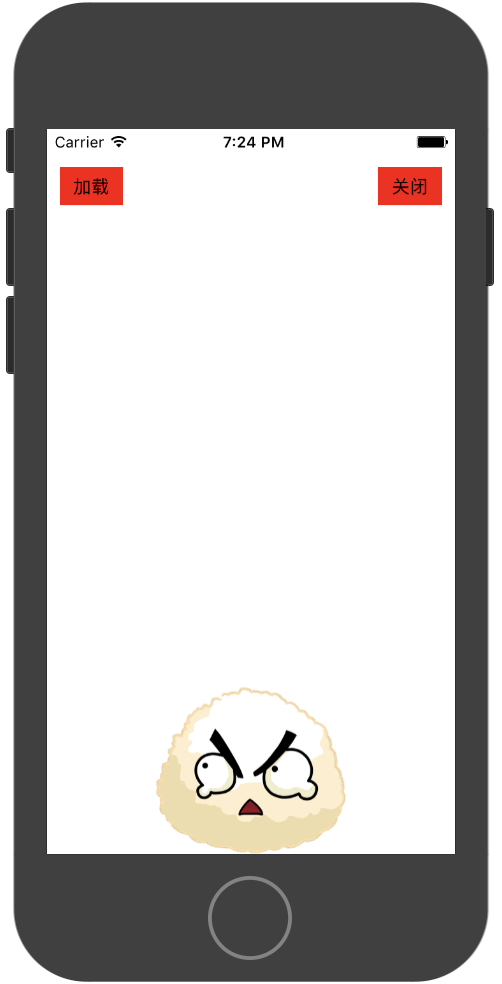

# 骨骼动画

bricks引擎只支持spine骨骼动画，不支持dragonbone

### 使用骨骼动画

传入骨骼动画资源路径便可调用

```
function startCB(animName:string,trackId:number,sk:BK.SkeletonAnimation)
{
    BK.Script.log(0,0,"Start Event Callback");
}
function completeCB(animName:string,trackId:number,sk:BK.SkeletonAnimation)
{
    BK.Script.log(0,0,"Complete Event Callback animName = "+ animName);
}
function endCB(animName:string,trackId:number,sk:BK.SkeletonAnimation)
{
    BK.Script.log(0,0,"End Event Callback");
}


var jsonPath = BK.Script.pathForResource("GameRes://resource/spine/suit/decelerator/Decelerator", 'json');
var atlasPath = BK.Script.pathForResource("GameRes://resource/spine/suit/decelerator/Decelerator", 'atlas');
var timeScale = 1; //播放速率
var rice =new BK.SkeletonAnimation(atlasPath, jsonPath, timeScale, startCB, completeCB, endCB );
rice.position = {x:200,y:100};

//播放spine资源里面的动作 
//并传入trackId为1（标识当次播放）
//动作名："standby_sender_0" 
//是否循环播放：true
rice.setAnimation(1,"standby_sender_0",true);
BK.Director.root.addChild(rice);

```


### 关于动画播放回调
开发者可以监听关于动画的三种事件，可以在骨骼动画构造函数中传入事件监听函数，也可单独使用setXXXCallback进行监听

```
ani.setStartCallback(function(aniName,trackId,ani){
	//动画开始
});
ani.setCompleteCallback(function(aniName,trackId,ani){
	//播放完一次
});
ani.setEndCallback(function(aniName,trackId,ani){
	//动画开始
});
```

* 动画开始播放 

   动画开始播放时开始调用

* 动作播放完一次
	
	使用循环播放时，每次动作播放完时回调。
		
* 动画结束播放
	
	情形1.当前被打断动画，即将播放下个动作
	
	情形2.BK.SkeletonAnimation被销毁前