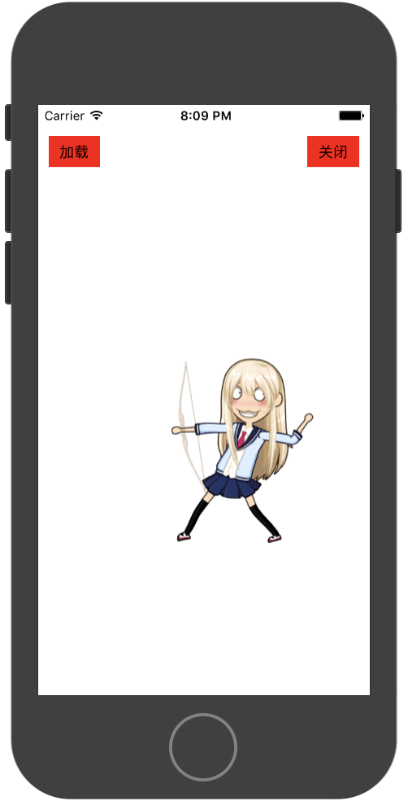

# 厘米秀形象

厘米秀骨骼动画是基于spine的二次开发，spine的属性均可以使用，除此外厘米秀小人可支持骨骼与装扮分离，实现换装功能。

普通spine资源中包含骨骼、以及动作信息，同一个骨骼除非替换资源，否则无法新增动作。

厘米秀形象则支持动画以及装扮素材的可拆分，即同一个骨骼可以装扮不同衣服，也可以使用不同动作。


### 厘米秀的加载流程
1.加载骨骼

使用BK.SkeletonAnimation构造函数传入骨骼文件

	
2.加载装扮

厘米秀套装由7件装扮组成。通过调用setAccessory设置


3.播放动画
	
与普通spine不同的是，需要先使用setAccessoryAnimation添加动作，再调用setAnimation进行播放
	
```
//加载骨骼
var jsonPath = BK.Script.pathForResource("GameRes://resource/spine/suit/default/role/role", 'json');
var atlasPath = BK.Script.pathForResource("GameRes://resource/spine/suit/default/role/role", 'atlas');
    
var ani =new BK.SkeletonAnimation(atlasPath, jsonPath, 1,startCB,completeCB,endCB );
ani.position = {x:BK.Director.screenPixelSize.width/2.0,y:300};
BK.Director.root.addChild(ani);
//加载装扮
var  accArray = ['FaceSuit', 'BackSuit', 'BottomSuit', 'FaceOrnament', 'TopSuit', 'HairType'];
for (var i=0;i<accArray.length;i++)
{
    var j = "GameRes://resource/spine/suit/default/" + accArray[i] + "/dress";
    var a = "GameRes://resource/spine/suit/default/" + accArray[i] + "/dress";
    var jPath = BK.Script.pathForResource(j, 'json');
    var aPath = BK.Script.pathForResource(a, 'atlas');
    ani.setAccessory(jPath, aPath);
}

//添加动画
var animJson  = BK.Script.pathForResource("GameRes://resource/spine/action/archery/action", 'json');
var animAtlas = BK.Script.pathForResource("GameRes://resource/spine/action/archery/action", 'atlas');
ani.setAccessoryAnimation(animJson, animAtlas, "anim1");

//播放动画
ani.setAnimation(12312,"anim1",true)

```


### accessory是什么？

accessory厘米秀装扮部件名词。厘米秀的小人由骨骼+7件装扮组合而成。7件装扮分别为'FaceSuit'脸, 'BackSuit'背饰, 'BottomSuit'下装, 'FaceOrnament'脸饰, 'TopSuit'上装, 'HairType'发饰七种装扮。开发者可以使用BK.SkeletonAnimation.accessoryTypes获取所有的装扮类型名称


熟悉spine的都知道spine中有几个基础的概念，bone，slot，attachment，而accessory与其中的关系相当于多个attachment的组合。即accessory隶属于多个attchment。

<font color=#ff0000>需要注意的是对于普通的spine动画，并不存在accessory</font>


## 更多例子

`BK.Script.loadlib("GameRes://script/demo/render/SkeletonDemo.js");`
