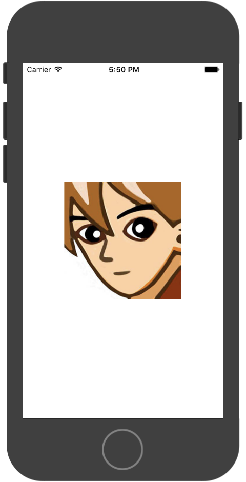
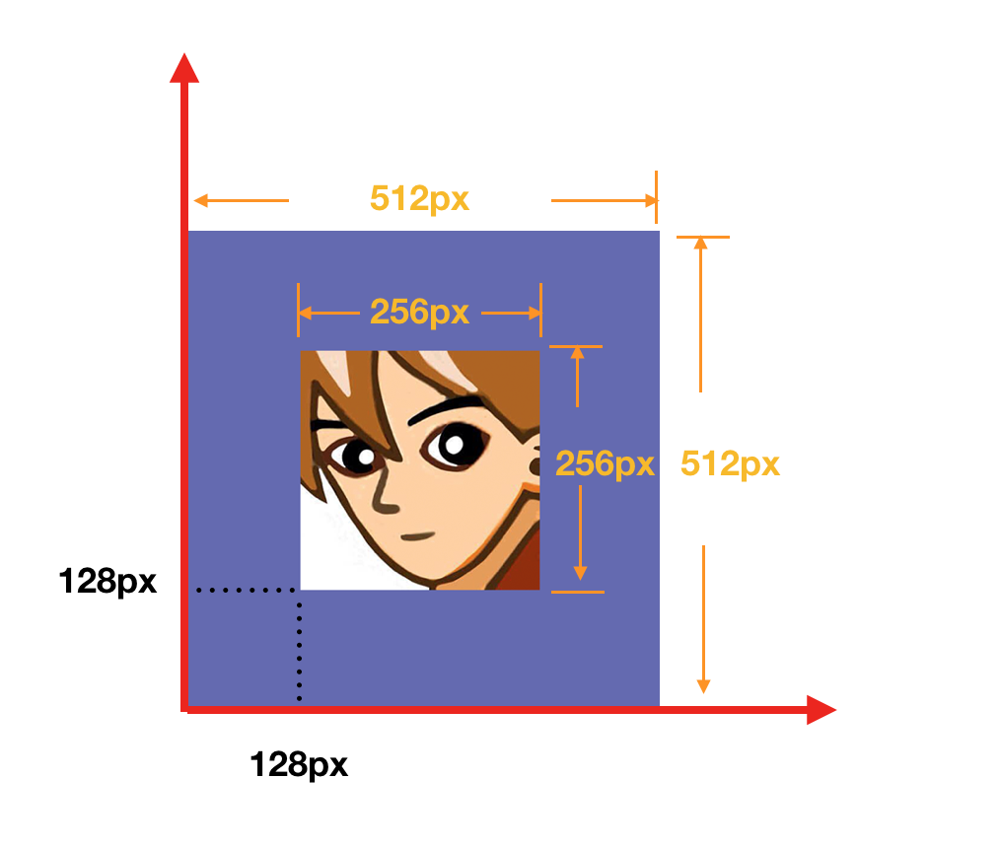
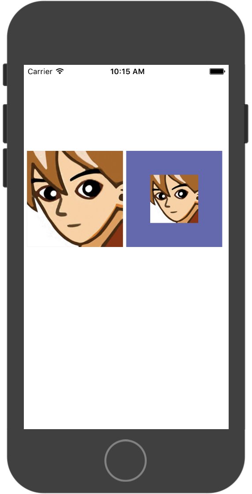

# 精灵

### 1.通过纹理加载
```
var screenSize = BK.Director.screenPixelSize;
var iconTex = new BK.Texture('GameRes://resource/texture/icon.png');
//通过纹理创建一个精灵
var iconSp = new BK.Sprite(750 / 2, 750 / 2, iconTex, 0, 1, 1, 1);
//设置到屏幕正中间
iconSp.position = { x: screenSize.width / 2.0, y: screenSize.height / 2.0 };
//锚点为0.5，0.5
iconSp.anchor = { x: 0.5, y: 0.5 };
//加入到根节点
BK.Director.root.addChild(iconSp);
```



### 2.通过图集加载

```
BK.Script.loadlib('GameRes://script/core/render/SpriteSheetCache.js');
//加载图集
var texPath = "GameRes://resource/texture/spritesheet/test.png";
var jsonPath = "GameRes://resource/texture/spritesheet/test.json";
//生成图集缓存对象
var sheetCache = new SpriteSheetCache();
sheetCache.loadSheet(jsonPath, texPath);
var sp = sheetCache.createSheetSprite("icon.png", 100, 100);
if (sp) {
    BK.Director.root.addChild(sp);
}
```

### 3.调整精灵中纹理位置
通过BK.Sprite的adjustTexturePosition函数可以调整纹理的位置，达到<font color="red">只显示某一部分</font>的效果。

例如: 
一张 512x512px 的图，期望只显示中间256 x256px的区域。
可以使用BK.Sprite的 adjustTexturePosition(128,128,256,256)可以达到效果，其中四个参数分别表示距离左下角的坐标x:128,y:128,显示区域大小width:256px,height:256px。
注意：<font color="red">四个参数单位均为像素</font>



例子：

```
//纹理位置不做调整
var iconBorderTex=new BK.Texture('GameRes://resource/texture/icon_border.png');
//通过纹理创建一个精灵
var iconBorderSp1 =new BK.Sprite(300,300,iconBorderTex,0,1,1,1);
iconBorderSp1.position = {x:320,y:screenSize.height/2.0};
BK.Director.root.addChild(iconBorderSp1);

//调整纹理位置
var iconBorderSp2 =new BK.Sprite(300,300,iconBorderTex,0,1,1,1);
iconBorderSp2.adjustTexturePosition(128,128,256,256);
iconBorderSp2.position = {x:10,y:screenSize.height/2.0};
BK.Director.root.addChild(iconBorderSp2);
```
显示结果



## 例子代码

`BK.Script.loadlib('GameRes://script/demo/sprite_demo.js');`