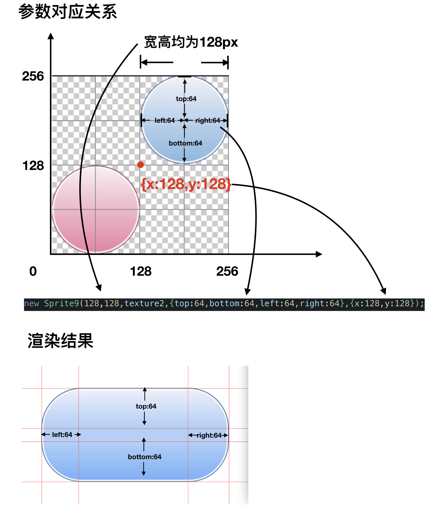

# 九宫图

使用九宫图前需加载Sprite9.js

加载九宫图如不指定size则为默认小图宽高。如下例，如不执行sprite9_2.size = { width: 300, height: 150 };则大小为128*128。

例子

```
BK.Script.loadlib('GameRes://script/core/render/Sprite9.js');
//1
var texture2 = new BK.Texture("GameRes://resource/texture/sprite9.png");
/**
 * 参数依次为
 * 1.使用的小图宽
 * 2.使用的小图高
 * 3.纹理
 * 4.九宫图 上下左右不可以伸缩的距离
 * 5.映射区域起始坐标
 */
var sprite9_2 = new Sprite9(128, 128, texture2, { top: 64, bottom: 64, left: 64, right: 64 }, { x: 128, y: 128 });
sprite9_2.position = { x: 100, y: 100 };
sprite9_2.size = { width: 300, height: 150 };
BK.Director.root.addChild(sprite9_2);
```

