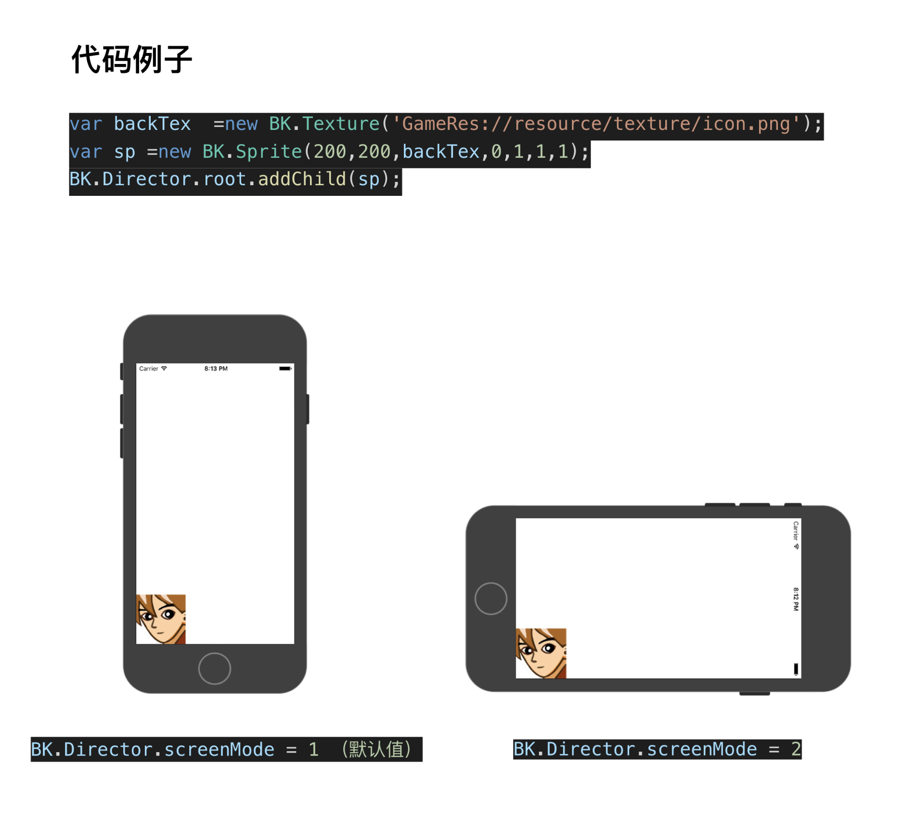

# 横竖屏

使用BK.Director.sceenMode属性可以设置横竖屏。
设置为横屏后，坐标系依然在左下角。

sceenMode属性值

属性值 | 说明|
----|----|
1 | 竖屏（默认）
2 | 横屏(Home在左边)
3 | 横屏(Home在右边)

实例代码

```
BK.Director.screenMode = 2;
var backTex  =new BK.Texture('GameRes://resource/texture/icon.png');
var sp =new BK.Sprite(200,200,backTex,0,1,1,1);
BK.Director.root.addChild(sp);
```


