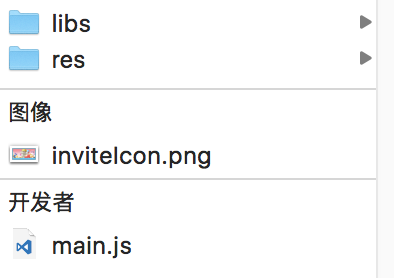

# 分享与邀请

## 邀请他人加入房间
<font color=#ff0000>前置条件：调用接口时需预先加载protocol.js
使用本接口时，需确保BK.Room房间已经创建成功</font>，否则无法正常发出信息。

咕咚大作战的发起邀请样例


### 使用方法

#### 1. 调用以下代码,其中wording为文案

BK.QQ.inviteFriend(wording)

#### 2.配置分享信息

分享至微信时形如下图


标题 ：现固定为为 快来和我玩+游戏名称 （游戏方此处不可修改）

子标题: 由接口中wording字段配置

图片：放置在游戏包根目录下，切命名必须为inviteIcon.png ，图片需为正方形，130*130,不超过32K



分享至手Q后其他玩家点击气泡即可进入游戏

## 分享连接

将带有url的跳分享到其他场景中，如其他人打开此气泡，则可以跳转至其中的url。


使用函数 BK.QQ.shareToMQQ(title, summary, detailUrl, picUrl) 分享游戏至手Q。 

需要注意的是，此函数并非邀请好友进入游戏，仅是将游戏detailUrl分享出来。其中detailUrl需游戏方自己提供，建议是该款游戏的介绍页

参数：

参数  | 类型 |名称 | 备注
------------- | ------------- | -------------| -------------
title | string | 标题 | 
summary | string | 分享内容 | 
detailUrl | string | 跳转详情url | 游戏方提供 
picUrl | string |  图片url | 游戏方提供

返回值:无

以迪斯尼过马路中的分享为例，具体参数对应的显示如下，点击后，将跳转至 detailUrl对应的地址


例子：

```
BK.QQ.shareToMQQ("迪斯尼过马路战绩","我获得了第1名，快来挑战我","www.xxx.com","xxx.com/xx.png");
```