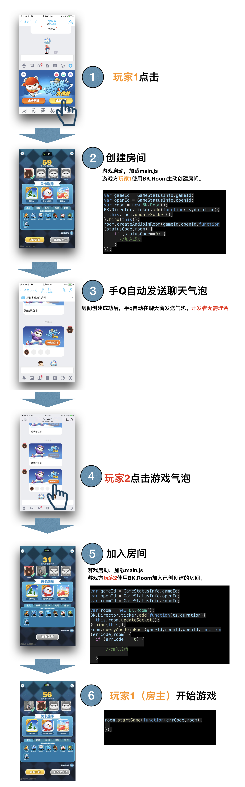

# [开发必看]基本概念

### 1.多人游戏基本流程
游戏中通过使用BK.Room对象中，createAndJoinRoom和queryAndJoinRoom来达到创建、加入房间的操作。

下面以最基本的单人、群聊天窗发起游戏逻辑进行说明，更加进阶的入口逻辑[点击此处]()

#### 具体流程如下。

1. 当用户点击进入游戏后，加载手Q会加载main.js（游戏主入口）。开发者需通过GameStatusInfo.isMaster是否为1判断是否为房主。

2. 如果为房主，则需要调用createAndJoinRoom创建房间。

3. 第2步骤后，若创建房间成功，手Q会在当前聊天窗发送一个游戏气泡

4. 其他玩家通过点击气泡后，会加载main.js（游戏主入口）。

5. 开发者通过GameStatusInfo.roomId拿到已经创建好roomId，调用queryAndJoinRoom加入已经存在的房间。

6. 房主调用startGame接口。开始游戏

**其他事项: 有些游戏需要有准备环节，但引擎层并不强制要求，也并没有单独接口用于达到准备的效果，所以第5.6步骤，开发者可用BK.Room 的广播接口[sendBroadcastData](http://hudong.qq.com/docs/engine/api/BK.Room.html)达到此目的**

### 2.protocol.js
改文件包含了与手Q数据交互、游戏房间逻辑，内购等接口。使用BK.QQ以及 BK.Room接口时需先显式调用

### 3.实现服务器通信
引擎支持四种网络方法与后台服务器进行通信。

厘米小游戏为开发者提供无需后台开发的帧同步和消息同步方案。如下表格（3，4种方案）

websocket与http因比较常见，在此不再展开，具体函数调用方法请看具体demo //TODO:

方法 | 具体对象 | 开发者是否需自建服务器| 备注
------------- |  -------------| -------------| -------------
http/https  | BK.HttpUtil  | 需要| [详情]() //TODO:
Websocket | BK.WebSocket |需要| [详情]() //TODO:
帧同步 | BK.Room |无| 使用BK.Room的成员函数syncOpt进行帧同步上行发送、使用setFrameSyncListener进行帧同步下行监听 [详情](http://hudong.qq.com/docs/engine/api/BK.Room.html)
消息同步|BK.Room |无| 使用BK.Room的成员函数sendBroadcastData进行上行发送、使用setBroadcastDataCallBack进行下行数据监听

### 4.在手Q运行游戏
