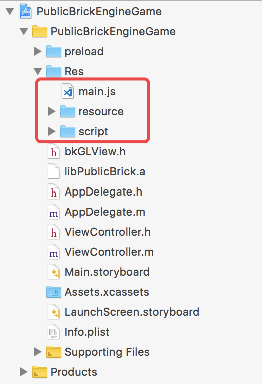
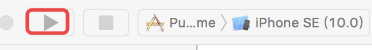
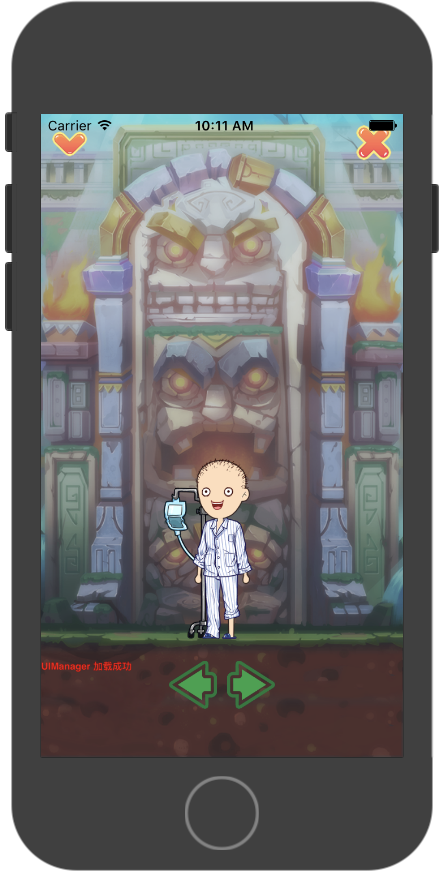

# 第一个游戏

现在工程暂仅支持Mac端。

### 拉取xcode工程
 将工程从[bitbuck地址](https://bitbucket.org/wesleyxiao/
 publicbrickengine/overview) 使用git clone下来后，点击 PublicBrickEngineGame.xcodeproj 

### 程序入口
js程序的入口如下，在Res/main.js中


main.js中有所有小游戏各个功能点的demo文件，此处默认运行 script/demo/SimpleGame/SimpleGameMain.js

运行本工程



运行结果如下


### 

### 接口命名
bricks引擎中所有的接口均为BK对象的属性
如 BK.Director，BK.Sprite等

###资源路径
脚本中访问脚本或者图片资源时，需以<font color="red">前缀+相对路径</font>的形式进行访问。

游戏中仅有两种资源路径，资源包所在的路径，手Q根据游戏ID分配的沙盒路径。

资源包所在的路径以GameRes://开头，对应的路径为main.js所在的路径。只可读不可写。

沙盒路径以GameSandBox://开头，文件可读可写。可用于存储游戏的存档信息等。

例如有如下的游戏包:
	 
	 |--main.js
	   |--res
	   	 |--img1.png
	   	 |--img2.png
	   |--lib
	   	 |--script1.js
	   	 |--script2.js
	 
	 当需要访问 /lib/script1.js，使用路径为 GameRes://lib/script1.js


### 如何绘制精灵

```
//1.创建一个纹理
var tex = new BK.Texture('GameRes://texture/test.png');  
//2.创建一个精灵对象 
var  sp = new BK.Sprite(100,100, tex,0,1,1,1);
//3.加入到根节点
BK.Director.root.addChild(sp);
```
bricks引擎中也支持其他骨骼动画（spine），网格（BK.Mesh）等绘制能力，详情请看能力章节

### 加载文件
bricks引擎不支持AMD和CommonJS加载方式。加载其他js文件如下

```
BK.Script.loadlib("GameRes://lib/script1.js")
```

### 全局变量GameStatusInfo
游戏启动后，引擎会为开发者写入名为GameStatusInfo的有关游戏的全局参数。开发者可以从此变量获取关于游戏的一些参数。

具体格式如下：

变量  | 类型 |名称 | 备注
------------- | ------------- | -------------| -------------
gameId  | number | 游戏id | 
isMaster | number | 是否是房主 | 1为房主，0为参加者
roomId | number | 房间号 | 房主时为0，参加者时为具体房间号
gameVersion | string | 游戏版本号 | 与游戏包强绑定的版本号。手Q测依赖此进行版本更新
platform | string | 平台类型 | 取值为 "ios"或"android"
openId | string | 当前用户的标识 | 用户的唯一标识
QQVer | string | 手机qq版本 | 形如"7.1.0.0"
isFirstPlay|number| 是否第一次打开|1为第一次玩游戏 0非第一次
networkType | number | 网络类型 | 游戏启动时的网络类型。 1 电信 ，2 联通 ，3 移动  0: wifi或未知
src | number | 游戏启动入口 | 100:实时PK，200:聊天窗游戏消息 更详细信息
spriteDesignHeight | number | 厘米秀小人spine动画的设计高度| 点击查看厘米秀骨骼动画章节
skltPath | Object | 厘米秀小人spine骨骼 |点击查看厘米秀骨骼动画章节
dressPath | Array | 厘米秀衣服路径 |点击查看厘米秀骨骼动画章节
```
GameStatusInfo = {
    "svrIp" : "14.17.42.125",       //游戏推荐ip。开发者可忽略
    "gameVersion" : "408.2",   //游戏版本号
    "isMaster" : 1,		            //是否房主，1房主，0参加者
    "gameId" : 3,          //游戏id
    "networkType" : 0,  //网络类型 1 电信 ，2 联通 ，3 移动  0: wifi或未知
    "roomId" : "0",          //房间号
    "platform" : "ios",    //平台类型
    "openId" : "72ED98114FE0D68FD23650B303B8AD80",  //当前用户的标识
    "spriteDesignHeight" : 368,   //厘米秀小人spine动画的设计高度
    "QQVer" : "7.1.0.0",		//手机qq版本
    "isFirstPlay" : 1,			//是否第一次玩
     "dressPath" : [			    //厘米秀衣服路径
                   {
                   "atlas" : "\/Clothes\/1\/playRes\/dress",
                   "json" : "\/Clothes\/1\/playRes\/dress"
                   },
                   {
                   "atlas" : "\/Clothes\/2\/playRes\/dress",
                   "json" : "\/Clothes\/2\/playRes\/dress"
                   },
                   {
                   "atlas" : "\/Clothes\/3\/playRes\/dress",
                   "json" : "\/Clothes\/3\/playRes\/dress"
                   },
                   {
                   "atlas" : "\/Clothes\/4\/playRes\/dress",
                   "json" : "\/Clothes\/4\/playRes\/dress"
                   },
                   {
                   "atlas" : "\/Clothes\/5\/playRes\/dress",
                   "json" : "\/Clothes\/5\/playRes\/dress"
                   },
                   {
                   "atlas" : "\/Clothes\/6\/playRes\/dress",
                   "json" : "\/Clothes\/6\/playRes\/dress"
                   },
                   {
                   "atlas" : "\/Clothes\/7\/playRes\/dress",
                   "json" : "\/Clothes\/7\/playRes\/dress"
                   }
                   ],
    "skltPath" : {			//厘米秀小人spine骨骼
        "atlas" : "\/Role\/0\/playRes\/role",
        "json" : "\/Role\/0\/playRes\/role"
    },
    "src" : 100 //游戏启动时入口标志 如100为聊天窗好友对战按钮
 }
```

### 坐标系与单位
bricks引擎中的坐标系与opengl的坐标系一致。坐标原点在屏幕的左下角，x轴正方向向右，y轴正方向上。 且引擎中所有数值均为实际像素。

### 错误调试
通过查询log关键字 "Execute JS Error" 可以查询到执行错误的行数和列数，以及文件的具体位置

