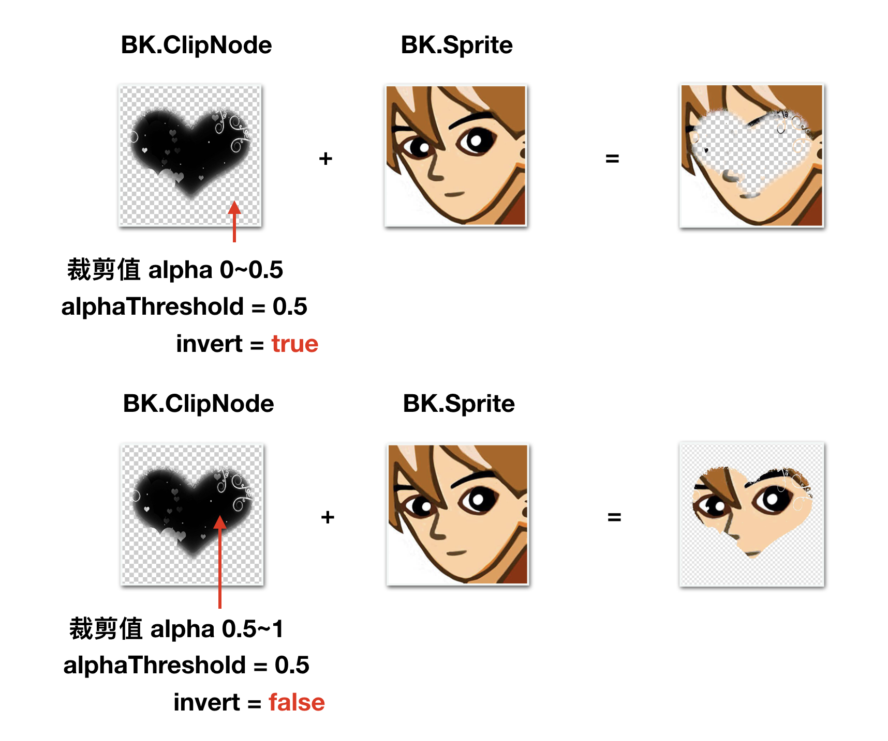

# 2.23 BK.ClipNode 蒙版节点
> 蒙版/裁剪节点
> 
> 可实现蒙版和裁剪特性的节点

### 成员变量

变量  | 类型 |名称 | 备注
------------- | ------------- | -------------| -------------
inverted | boolean | 执行阈值向 | 默认为false。true时，取alpha 0-alphaThreshold值，false时取alphaThreshold-1值
alphaThreshold | number | 裁剪透明度的阈值 | 无

###方法

#### 构造函数 new BK.ClipNode(stencilSp)
参数  | 类型 |名称 | 备注
------------- | ------------- | -------------| -------------
stencilSp | BK.Texture | 蒙版纹理 |  

##使用方法
1. 新增一个模板纹理
2. 通过模板纹理创建蒙版节点
3. 加入一个叠加精灵
4. 设置叠加参数


### 例子：

```
//对应下图例1

var wid = BK.Director.screenPixelSize.width
var stencilTex = new BK.Texture("GameRes://texture/mask/mask1.png");
var stencilSp = new  BK.Sprite(wid, wid, stencilTex, 0, 1, 1, 1);
var clipNode =new BK.ClipNode(stencilSp);
var tex = new BK.Texture("GameRes://texture/icon.png");
var sp =new BK.Sprite(wid,wid,tex,0,1,1,1);

BK.Director.root.addChild(clipNode);
clipNode.addChild(sp);
clipNode.inverted = true;
clipNode.alphaThreshold = 0.5;


//对应下图例2
var wid = BK.Director.screenPixelSize.width
var stencilTex = new BK.Texture("GameRes://texture/mask/mask1.png");
var stencilSp = new  BK.Sprite(wid, wid, stencilTex, 0, 1, 1, 1);
var clipNode =new BK.ClipNode(stencilSp);
var tex = new BK.Texture("GameRes://texture/icon.png");
var sp =new BK.Sprite(wid,wid,tex,0,1,1,1);

BK.Director.root.addChild(clipNode);
clipNode.addChild(sp);
clipNode.inverted = false;
clipNode.alphaThreshold = 0.5;

```
	
	
###具体图示
蒙版节点的两个属性inverted与alphaThreshold用于决定蒙版区域。




##实例代码
详细代码请参考
```BK.Script.loadlib("GameRes://script/demo/render/clip_node_demo.js");```