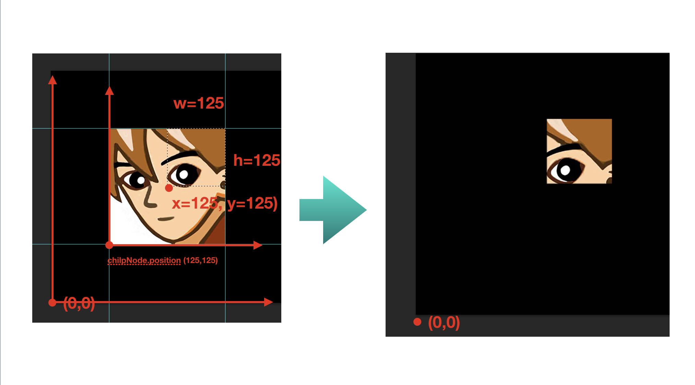

# 2.24 BK.ClipRectNode 裁剪节点
>裁剪节点
### 成员变量
变量  | 类型 |名称 | 备注
------------- | ------------- | -------------| -------------
clipRegion | number | 裁剪区域 | 无
enableClip | boolean | 是否开启裁剪 | 默认true

###方法

#### 构造函数 new BK.ClipRectNode(x,y,w,h)

参数  | 类型 |名称 | 备注
------------- | ------------- | -------------| -------------
x | number | 裁剪区域x坐标 |  
y | number | 裁剪区域y坐标 |  
width | number | 裁剪区域宽 |  
height | number | 裁剪区域高 |  

返回值：

 类型 |名称 | 备注
------------- | ------------- | -------------
 BK.ClipRectNode |裁剪节点对象 |
 
 ###使用方法
 1.创建BK.ClipRectNode
 2.创建BK.Sprite并加入到 BK.ClipRectNode中，作为子节点
 3.设置裁剪参数（也可以在创建BK.ClipRectNode时指定）
 
 
 例子:

```
 var clipNode =new BK.ClipRectNode( 125, 125, 125, 125);
clipNode.position = {x: 125, y: 125, z: 0};

BK.Director.root.addChild(clipNode);
var tex = new BK.Texture("GameRes://texture/icon.png");
var sp =new BK.Sprite(250,250,tex,0,1,1,1);
clipNode.addChild(sp);
```

##图示
上例子中显示的结果如下



##示例代码
详细代码请参考
```BK.Script.loadlib("GameRes://script/demo/render/clip_rect_node_demo.js");```

