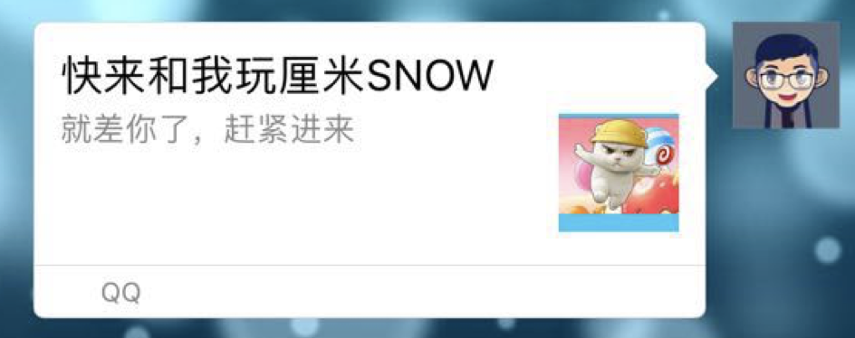
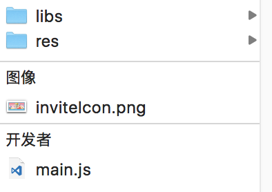

# 5.5 分享与邀请

## 发送游戏邀请链接至手Q/微信
<font color=#ff0000>前置条件：调用接口时需预先加载protocol.js</font>

#### 1. 调用以下代码,其中wording为文案

BK.QQ.inviteFriend(wording)

#### 2.配置分享信息

分享至微信时形如下图



标题 ：现固定为为 快来和我玩+游戏名称 （游戏方此处不可修改）

子标题: 由接口中wording字段配置

图片：放置在游戏包根目录下，切命名必须为inviteIcon.png ，图片需为正方形，130*130,不超过32K



分享至手Q后其他玩家点击气泡即可进入游戏

##分享游戏至手Q

其中游戏侧自己提供跳转链接detailUrl、icon图片链接picUrl。

```
var cmd = "cs.share_game_result.local";
var data = {
   title: "小游戏战绩",  //标题
   summary: "我在本次好友PK比赛中取得第一名，快来挑战我吧", //文案
   detailUrl: "http://ad.html",          //跳转url （游戏方提供）
   picUrl: "http://f.xxx.com/icon.png",  //分享icon（游戏方提供）   
   gameId: GameStatusInfo.gameId,        //游戏id
   roomId: 123456789,                    //房间id	
   gameVersion: "游戏版本号",              //游戏版本号
   openId: GameStatusInfo.openId,        //openId
   cmd: cmd,
};
BK.MQQ.SsoRequest.send(data, cmd);
```