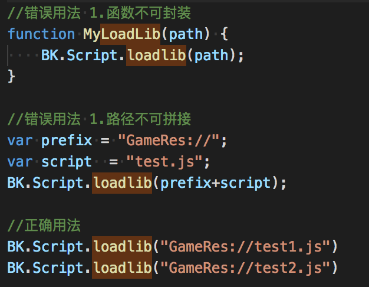
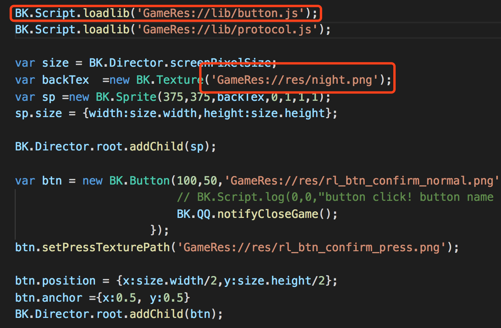
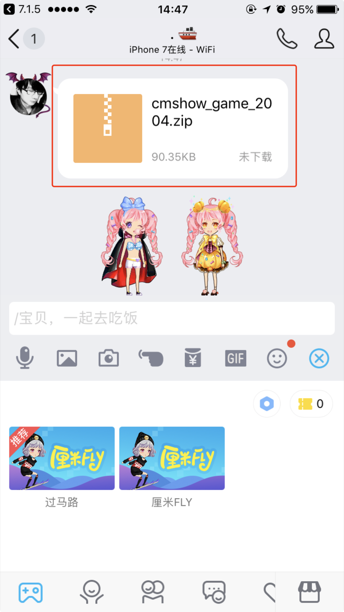
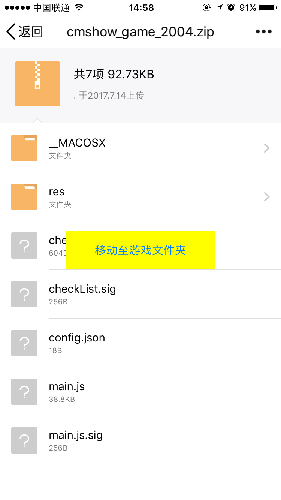
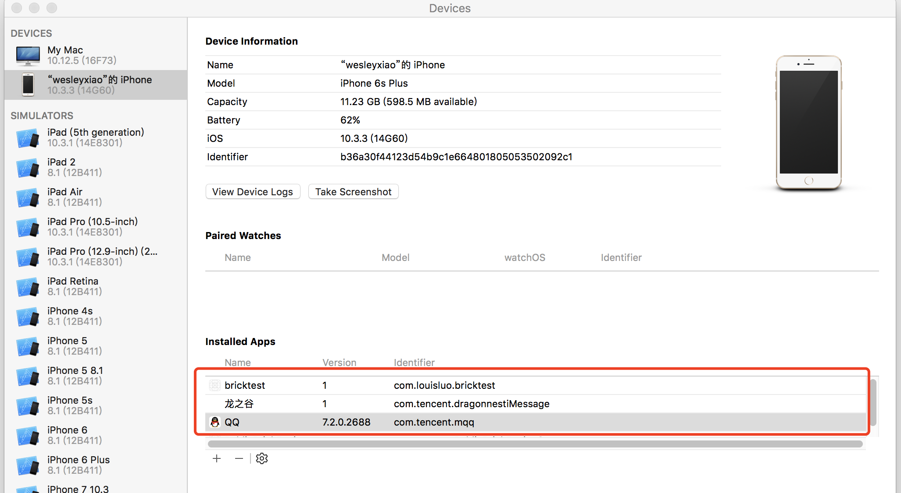
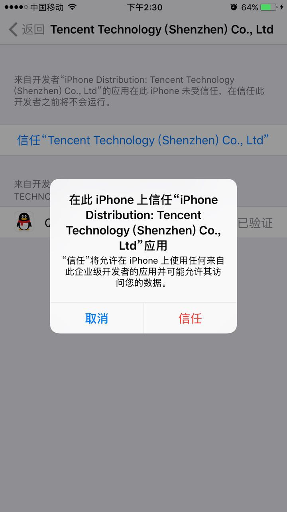

# 5.2 文件打包与运行

## 1. 源文件命名
源文件的入口必须命名为 main.js  除此之外，资源文件夹以及其他脚本文件命令以及路径并无要求。
## 2. 打包
将工程打包值手Q运行时中，有以下几个要求

* 必须打包的文件 main.js （游戏主入口）、protocol.js（房间管理）、inviteIcon.png（邀请气泡图）。其他脚本以及资源开发者可按需打包，手Q在启动时已经加载了brick.js与game.js开发者无需关心，**无引用的代码请不要打包！**。

* main.js以及inviteIcon.png必须在同一个目录。其他文件目录结构不做要求

* zip包名称为 cmshow_game_xxx.zip  ,xxx对应游戏的gameId

* 使用BK.Script.loadlib加载其他文件时，GameRes://为main.js所在的目录，访问其他文件、图片、资源的路径时必须以此为相对路径。
* BK.Script.loadlib 必须明文调用，不可对其进行封装调用,路径也不可拼接	


#### 打包例子：
在Mac下，文件结构如下，新建了lib文件夹用于存放脚本，res文件夹存放资源。
因为GameRes://代表main.js所在的目录。

当使用BK.Script.loadlib时，路径为<font color=#ff0000> GameRes://lib/button.js</font>

同理访问res/night.png时路径为<font color=#ff0000>GameRes://res/night.png </font>




将main.js以及其他文件及文件夹打包成zip包，并且将文件命名为 cmshow_game_XXX.zip 其中XXX为gameId 。
使用cd命令跳转至截图中的game文件夹，例如

  ```cd   /Users/wesleyxiao/Documents/game ```
  
使用zip命令时将必须的main.js、inviteIcon.png、protocol.js（<font color=#ff0000>已包含在res文件夹</font>）以及lib一起打包(文件名中XXX必须为开发者自己的gameId)

  zip -r ./cmshow_game_xxx.zip <font color=#ff0000> lib/ res/ main.js inviteIcon.png</font>

PS:本例子可在publicbrickengine/QQPackage进行查阅

## 3. 游戏包替换方法

### Android版手Q替换方法
1. 关闭文件校验开关
  
  打开手Q->左抽屉->测试环境设置 将 厘米秀游戏文件验证开关 置为关闭状态
  
2. 本地替换文件

将设备USB连接电脑后，使用电脑端手机助手软件（如应用宝、91助手）,访问手机内存卡/tencent/MobileQQ/.apollo/game/xxx 。其中xxx对应游戏gameId。

将游戏包内容替换到该文件夹下即可。

注意意放置main.js位置必须放置正确。如gameId为1234,则必须确认main.js放置在/tencent/MobileQQ/.apollo/game/1234/main.js


###iPhone版手Q替换方法 

点击气泡后，下载至本地后，点击“移动至游戏文件夹”




<font color=#ff0000>使用上述功能，调试手q为特殊版本，请联系对接产品同学获取手q包</font>

特殊版本手Q安装指引

安装特殊版本手Q时，需确保

1.删除App Store版本的手Q

2.保持手机网络通畅

3.确保设备开启了ios的开发者模式。


可使用iTools等第三方软件进行安装，也可以使用xcode Window-Devices 并将ipa包拖拽至下方红框位置进行安装



如遇 “未信任的企业级开发者”弹窗提示，
 请跳转至 设置-通用-描述文件与设备管理   将Teccent Technology(XXX) 设置为信任





## 提取log
ios版本的手Q可以通过 <font color=#ff0000>左抽屉-设置-日志上报</font> 将日志提取出来，以便进行debug，关键字搜索“brick_log”
android版本手Q可通过设备连接Android Studio 进行日志查看。
