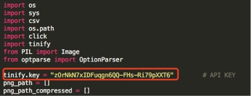
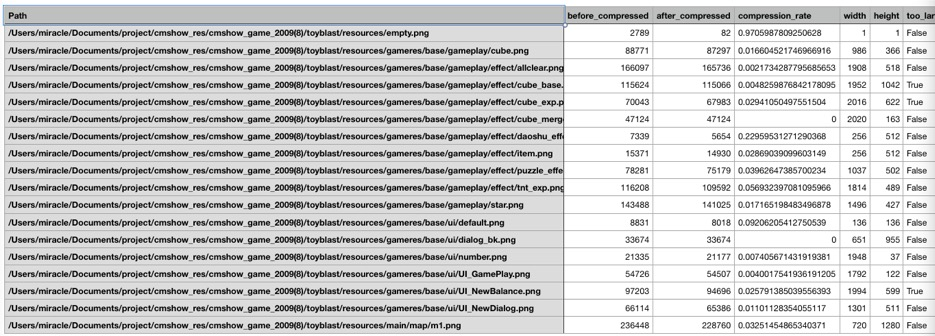

# 5.1.2 png图片压缩
bricks图片必须为png格式，不支持jpg。

为了减少图片资源的大小及内存占用，需要游戏对图片资源进行压缩和尺寸缩放。图片要尽量符合以下两个原则：

1.游戏资源图片须经过该脚本检测，保证PNG资源已经压缩到极致。

2.png图片的宽高尽量不超过1024*1024。（保持较小的内存占用和良好的流畅体验）

3.使用图集多个小图合成一张大图。

###TinyPNG压缩步骤：

1.[https://tinypng.com/developers]()申请API KEY，每个API KEY每月可以免费压缩500张，可申请多个API KEY。

2.将API KEY填入脚本



3.脚本运行方式python tinypng.py –d dirname.

```
-d 参数必须设置！
python tinypng.py [options] 
	-example:python tinypng.py -d xxx	
```


###脚本运行环境

1. 本地安装python环境，推荐使用python 2.x

2. 脚本依赖tinify和PIL库，下载链接如下：

Tinify:[https://pypi.python.org/pypi/tinify](https://pypi.python.org/pypi/tinify)

PIL: [https://pypi.python.org/pypi/tinify](http://www.pythonware.com/products/pil/)

####脚本输出结果



Path：资源图片路径

Before_compressed：图片压缩前大小

After_compressed：图片压缩后大小

Compression_rate：压缩率

Width/Height：图片宽/高

Too_large_scale：尺寸是否过大

压缩后图片存放在原资源图片同目录，前缀名为tiny_，**尽量使用压缩后的图片**（请美术同学review压缩后图片是否符合要求）。对于**too_large_scale为True的图片进行缩放，尽量使图片尺寸控制在1024*1024范围内**。

tinypng.py脚本[下载链接](http://119.29.134.111/mqq/tinypng.py)
