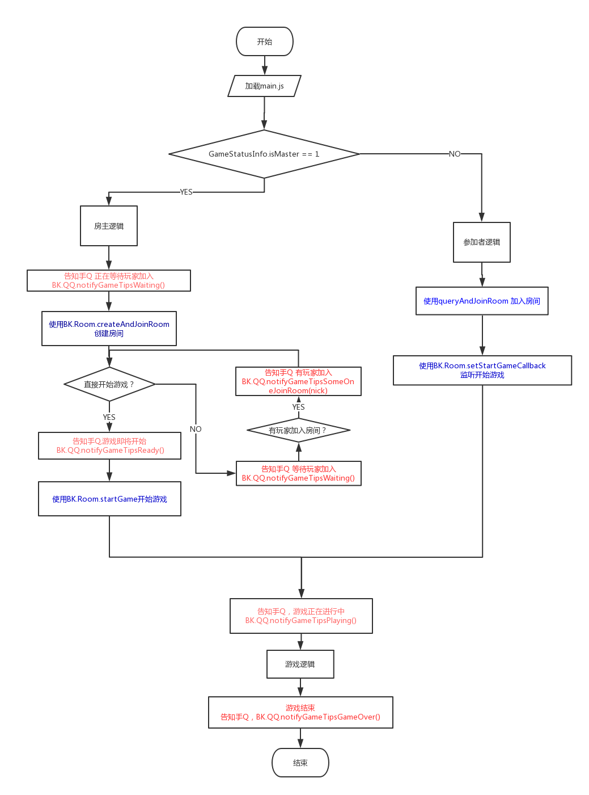
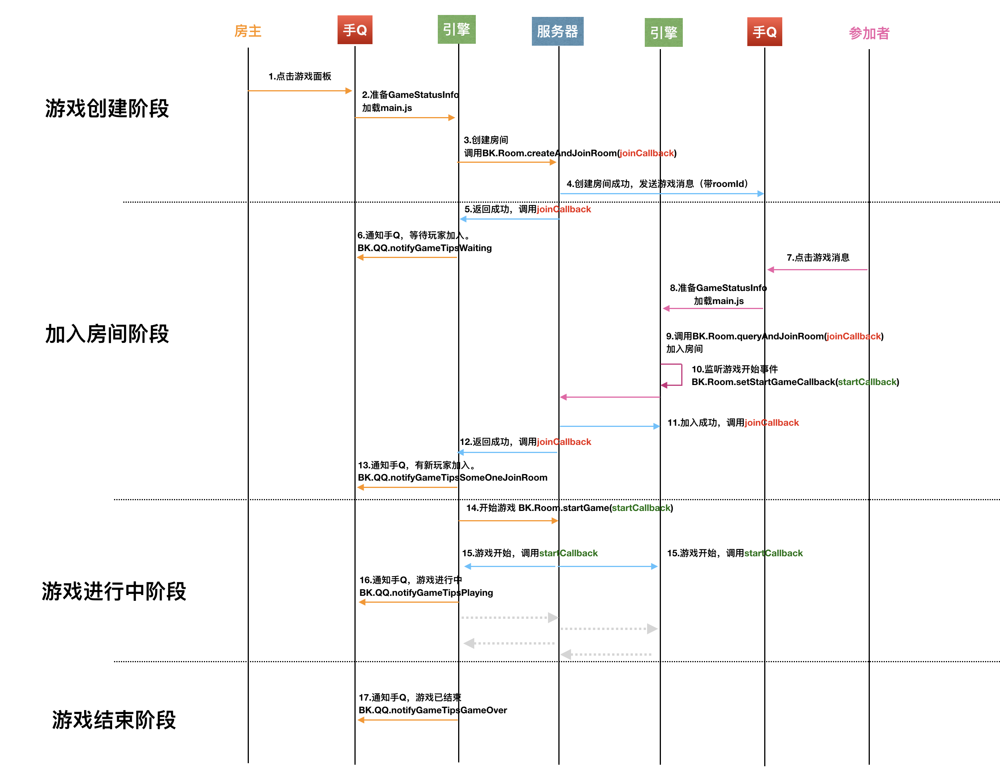

# 3.1 房间流程

## 游戏整体逻辑

## 加入房间详细时序图

上图为从房主创建房间到参加者加入房间的整体流程。

### 注意点：
1.后台有30秒的保活逻辑。开发者需要确保30内有调用BK.Room.sendKeepAlive 、BK.Room.sendBroadcastData、BK.Room.sendSyncOpt三个方法之一。

2.游戏结束、或中途退出时，都需要将成绩进行上报。上报的方式在[这里](http://119.29.134.111/mqq/result-upload.html)
  需要注意的是，中途退出时需上报所有人的成绩，且成绩需为0，用以告知后台。