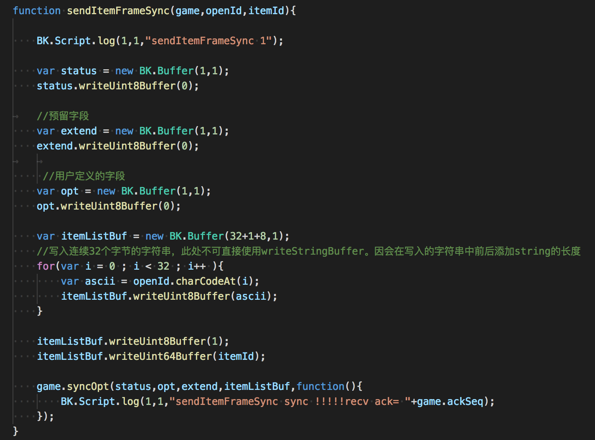
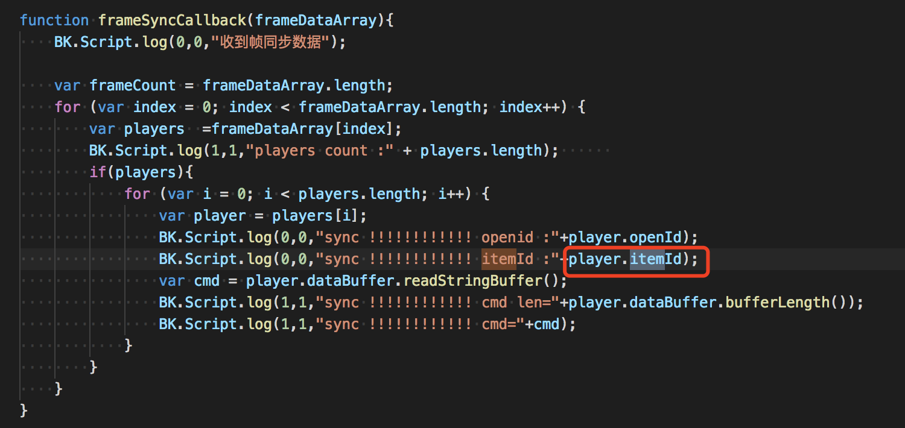

# 3.1 道具

## 获取游戏所有道具

```
    var cmd = "apollo_aio_game.get_game_itemList"
    var data = {
        "cmd":cmd,
        "from": GameStatusInfo.platform,  //描述请求来源或场景 h5.xxx.yyy/ios.xxx.yyy/android.xxx.yyy 用于后台统计
        "gameId":GameStatusInfo.gameId
    }

    BK.MQQ.SsoRequest.addListener(cmd,undefined,function(errCode,cmd,data){
        BK.Script.log(0,0," reveive sso cmd = "+ cmd)
        var itemList = [];
        if(data){
            if(data.data){
                if(data.data.itemList){
                    data.data.itemList.forEach(function(element) {
                        var item = {    
                         "id":element.id,               //道具ID 
                         "name":element.name,           //道具名称
                         "consumed":element.consumed,   //是否消耗型【0-非消耗型 1-消耗型】
                         "uinque":element.uinque,       //是否绝版【0-非绝版，1-绝版】
                         "iconUrl":element.iconUrl,     //素材iconurl
                         "curreInfo":element.curreInfo  //价格数组 因支持多货币，每个元素为某种货币的价格
                        //  "curreInfo":[
                        //                     {
                        //                     "curreType":3,    //3-游戏点券 4-二级货币（暂不能用）
                        //                     "price":1000     //价格
                        //                     }]    
                         }
                        itemList.push(item);
                        BK.Script.log(0,0,"id ="+ item.id + " name="+item.name+ " consumed="+item.consumed+" unique="+item.uinque+ " iconUrl="+item.iconUrl + " curreInfo="+item.curreInfo) ;   
                    }, this);
                }
            }
        }
    });
    BK.MQQ.SsoRequest.send(data,cmd);
```


## 获取用户拥有的游戏道具

通过调用下方代码可以获取当前用户的道具信息

```
	var cmd = "apollo_aio_game.get_user_game_items"
	var data = {
	    "cmd":cmd,
	    "from": "ios",  //描述请求来源或场景 h5.xxx.yyy/ios.xxx.yyy/android.xxx.yyy 用于后台统计
	    "gameId":3,
	    "openId":"DASGTERDF126556365"
	}
    
	BK.MQQ.SsoRequest.addListener(cmd,undefined,function(errCode,cmd,data){
	    BK.Script.log(0,0," reveive sso cmd = "+ cmd)
	    var itemList = [];
	    if(data){
	        if(data.data){
	            if(data.data.itemList){
	                data.data.itemList.forEach(function(element) {
	                                            var item = {
	                                                "consumed": element.consumed,
	                                                "iconUrl":  element.iconUrl, 
	                                                "id": element.id, 
	                                                "name": element.name, 
	                                                "num": element.num
	                                            }
	                                            itemList.push(item);
	                                            BK.Script.log(0,0,"consumed="+ item.consumed + " iconUrl="+item.iconUrl + " id="+item.id + " name="+item.name + " num="+item.num) ;   
	                                        }, this);
	            }
	        }
	    }
	});
	BK.MQQ.SsoRequest.send(data,cmd);
```

## 购买道具

```
   var itemID = 2025;
   var itemNum = 20;
   var cmd  = "apollo_aio_game.buy_game_items";

   var data =  {
        "cmd":cmd,
        "from" : GameStatusInfo.platform,//描述请求来源或场景 h5.xxx.yyy/ios.xxx.yyy/android.xxx.yyy 用于后台统计
    　　 "gameId":GameStatusInfo.gameId,  //游戏ID
        "curreType":3,                   //3-游戏点券 4-二级货币（暂不能用）
    　　"itemIdList":[                    //购买的道具列表
    　　     { 
    　　         "id":itemID,           //道具ID
    　　         "num":itemNum          //道具数量
    　　     }
    　　]
    }

    BK.MQQ.SsoRequest.addListener(cmd,undefined,function(errCode,cmd,data){
        BK.Script.log(0,0," reveive sso cmd = "+ cmd + " errCode = "+errCode)
        var itemList = [];
        if(data){
            if(data.data){
                //游戏ID
                if (data.data.gameId) {
                    BK.Script.log(0,0,"gameId = "+data.data.gameId);
                }
                //使用的货币
                if (data.data.curreType) {
                    BK.Script.log(0,0,"curreType = "+data.data.curreType);
                }
                //剩余货币
                if (data.data.currency) {
                    BK.Script.log(0,0,"currency = "+data.data.currency);
                }
                //购买的道具列表
                if(data.data.itemList){
                    data.data.itemList.forEach(function(element) {
                        var item = {    
                         "id":element.id,             //道具ID 
                         "num":element.num,           //道具名称
                         }
                        itemList.push(item);
                        BK.Script.log(0,0,"id ="+ item.id + " num="+item.num) ;   
                    }, this);
                }

                //道具鉴权错误, 无错误时无此字段
                if (data.data.authRet) {
                    var authRet = data.data.authRet;
                    var failId = authRet.id; //道具ID
                    var failRet = authRet.ret;//错误码   
                    BK.Script.log(0,0,"authRet failId="+ failId + " failRet="+failRet) ; 
                }
            }
        }
    });
    BK.MQQ.SsoRequest.send(data,cmd);

```
道具相关错误码请查阅 2.20.1 错误码
 
## 消耗道具

游戏中消耗道具，需要以帧同步的方式发送至游戏后台后，进行校验，消耗成功后，游戏后台也以帧同步的方式推送至房间内的所有玩家


完整流程代码请看frameSync_demo.js，此处仅列出消耗代码

下例为向后台发送消耗道具帧同步消息




###注意点：
<font color=#ff0000>一帧中仅仅能消耗一个道具</font>