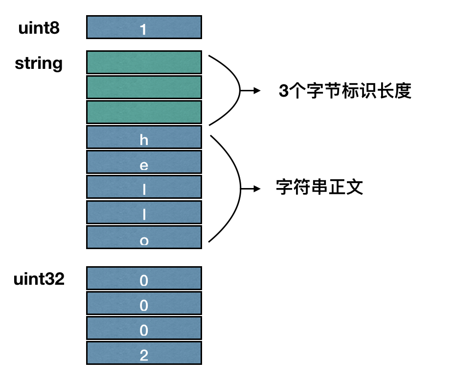

# 3.2 通信协议

进行房间逻辑开发时，必须使用protocol.js提供的接口进行房间创建、开始、结束。不可使用其他的网络接口。


## 帧同步与消息同步
引擎为开发提供帧同步与消息同步两套同步协议。同一款游戏可以同时使用两种协议。

### 消息同步
> 向房间内所有玩家广播消息。

该消息协议有以下几个特点

* 玩家加入游戏后即可发送
* 消息不保存
* 可能存在丢包。基于udp

#### 用途
因玩家加入游戏后便可使用，可用于游戏开始前同步数据，也用于作为游戏主协议

#### 接口
发送：

BK.Room.sendBroadcastData(buffer)

监听：

BK.Room.setBroadcastDataCallBack(broadcastCallback)

#### 例子

```
function sendBroadcastData(game) {
    //用户定义的字段
    let req = '{"s":"12345678901234567890AB","m":"map","d":"2"}';
    
    BK.Script.log(0,0,"sendBroadcastData :"+ req.length);
    var data = new BK.Buffer(req.length);
    data.writeStringBuffer(req);
    game.sendBroadcastData(data);
}

function broadcastCallback(fromId,buff)
{
     var data = buff.readStringBuffer()
     BK.Script.log(0,0,"broadcastCallback :"+ buff.bufferLength());
     BK.Script.log(0,0,"broadcastCallback str:"+ data);
}

var game = new BK.Room();

//创建或加入房间后
....


//设置广播回调监听      
game.setBroadcastDataCallBack(broadcastCallback);
//发送广播事件
sendBroadcastData(game);

```


#### 生命周期
加入游戏后，直游戏结束都可以使用

### 帧同步
> 向房间内所有玩家发送帧同步消息。

该消息协议有以下几个特点

* 房主调用startgame后，才可使用
* 消息可回溯


#### 接口

```
function frameSyncCallback(frameDataArray){
    BK.Script.log(0,0,"收到帧同步数据");

    var frameCount = frameDataArray.length;
    for (var index = 0; index < frameDataArray.length; index++) {

        var players  =frameDataArray[index];
        BK.Script.log(0,0,"帧同步帧序列号 = " +players.frameSeq);

        BK.Script.log(1,1,"players count :" + players.length);      
        if(players){
            for (var i = 0; i < players.length; i++) {
                var player = players[i];
                BK.Script.log(0,0,"sync !!!!!!!!!!!! openid :"+player.openId);
                BK.Script.log(0,0,"sync !!!!!!!!!!!! itemId :"+player.itemId);
                var cmd = player.dataBuffer.readStringBuffer();
                BK.Script.log(1,1,"sync !!!!!!!!!!!! cmd len="+player.dataBuffer.bufferLength());
                BK.Script.log(1,1,"sync !!!!!!!!!!!! cmd="+cmd);
            }
        }
    }
}

function sendFrameSyncCmd(game,cmd)
{
    //用户定义的字段
    var opt = new BK.Buffer(1,1);
    opt.writeUint8Buffer(cmd);

    BK.Script.log(1,1,"sync !!!!!send frame 1");

    var status = new BK.Buffer(1,1);
    status.writeUint8Buffer(0);

    //预留字段
    var extend = new BK.Buffer(1,1);
    extend.writeUint8Buffer(0);
        
    //send 
    game.syncOpt(status,opt,extend,undefined,function(){
        BK.Script.log(1,1,"sync !!!!!recv ack= "+game.ackSeq);
    });
}

var game = new BK.Room();

//收到startgame回调后
....

//监听帧同步
game.setFrameSyncListener(frameSyncCallback);
sendFrameSyncCmd(game);

```

### 数据读写
帧同步、消息同步中数据的读写需要一一匹配。

例如：

使用writeStringBuffer将"Hello"字符串写入BK.Buffer并且发送消息同步
```
//发送端
 var str = "Hello";
 var data = new BK.Buffer(str.length);
 data.writeStringBuffer(req);
 game.sendBroadcastData(data);
```
接收端，需用writeStringBuffer对应的读取函数readAsString将得到的BK.Buffer以字符串读取出来
```
var data = buff.readStringBuffer()
```
#### 多类型数据读写
此处需要注意的是，writeAsString函数与readAsString函数是将整个BK.Buffer对象存储的数据都看做字符串进行读写。也就是当BK.Buffer存储的内容都为字符串时，可以使用两个函数整体的读写。

因BK.Buffer支持多种不同类型的格式写入到一个对象中，例如写入一个unit8，写入字符串，再写入一个uint32位的数据。引擎将各个数据以字符偏移的形式写入到BK.Buffer中，当需要写入多个对象中存在字符时需多申请3个字节的空间，用于标识字符的大小。

//发送时写入一个unit8，写入字符串，再写入一个uint32位的数据
则需申请 1 + 字符串长度+3 + 4 个字节的长度BK.Buffer。如下例子，字符为“hello”时，需申请1+3+3+4 = 11字节的长度的buffer。

```
var str = "hello"
var buff = new BK.Buffer(str.length + 3 + 1 + 4);

var numUint8 = 1;
var numUint32 = 2;
buff.writeUint8Buffer(numUint8);
buff.writeStringBuffer(str);
buff.writeUint32Buffer(numUint32);
```
依次写入后buffer结构的结构如下


终端接收到服务器的推送时，读取也应该按顺序进行读取。这需要注意的是读取字符串时需使用和writeStringBuffer匹配的读取函数readStringBuffer，不可使用writeAsString。writeAsString是将整段buffer以字符串的形式读取出来，并无考虑字符标识长度。

```
//接收端
BK.Script.log(0,0,buff.readUint8Buffer());
BK.Script.log(0,0,buff.readStringBuffer());
BK.Script.log(0,0,buff.readUint32Buffer());
```

