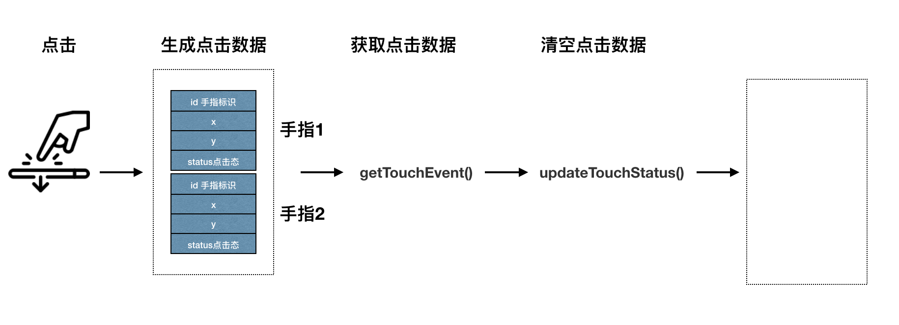

# 3.1 触摸事件

## 触摸事件原理
用户点屏幕后，将引擎将生成触摸数据（支持多点触控），并存放到引擎的触摸数据缓存中，通过调用`BK.TouchEvent.getTouchEvent()`获取触摸数据，当调用`BK.TouchEvent.updateTouchStatus()`时清空触摸数据缓存，进入下一次的触摸事件中。

大体流程如下图



因此，每当调用`BK.TouchEvent.updateTouchStatus()`后马上调用调用`BK.TouchEvent.getTouchEvent()`时，如果无新的用户点击将获取不到新的点击事件。同时也决定了js调用时，<font color=#ff0000>整个游戏中仅能有一处处理触摸事件的代码，若出现多次则会发生紊乱。</font>

实例代码

```
BK.Director.ticker.add(function(ts,du)
{
    //获取触摸数据
    var touchArr = BK.TouchEvent.getTouchEvent();
    if(touchArr == undefined){
        return;
    }
	
    for(var i=0;i<touchArr.length;i++){
        var x = touchArr[i].x;
        var y = touchArr[i].y;
        var status = touchArr[i].status;
        var id = touchArr[i].id;
        BK.Script.log(0,0,"id:"+id+" status:"+status+" x:"+x+" y:"+y);
    }

    //清空触摸数据
    BK.TouchEvent.updateTouchStatus();
});
```
## 简单的点击、移动、抬起事件封装
引擎封装了简单的点击、移动、抬起事件。若需使用需预先引用script/core/ui/ui_event.js文件。

实例代码：

下例子为使用ui_event.js的监听函数，监听sp对象的点击，移动，抬起事件。

```
BK.Script.loadlib('GameRes://script/core/ui/ui_event.js');

//使用BK.Sprite对点击，移动，抬起事件进行监听
function onBegin(node,evt,x,y)
{
 	//do something
}
function onMove(node,evt,x,y)
{
 	//do something
}
function onEnd(node,evt,x,y)
{
 	//do something
}
var backTex  =new BK.Texture('GameRes://texture/star.png');
var sp =new BK.Sprite(200,200,backTex,0,1,1,1);
sp.position = {x:x,y:y};
sp.canUserInteract = true;

UIEventHandler.addNodeEvent(sp,UI_NODE_ENENT_TOUCH_BEGIN,onBegin);
UIEventHandler.addNodeEvent(sp,UI_NODE_ENENT_TOUCH_MOVED,onMove);
UIEventHandler.addNodeEvent(sp,UI_NODE_ENENT_TOUCH_END,onEnd);

BK.Director.root.addChild(sp);
```

## 注意事项

ui_event.js中使用到的触摸事件粒度如果不满足开发者的需求，开发者可以模仿ui_event.js对于触摸事件的分发处理进行二次开发。<font color=#ff0000>但需要注意的是，单个游戏中处理触摸事件的地方仅能有一处，也就是一旦使用ui_event.js了，不可有第二处代码进行处理触摸事件。</font>